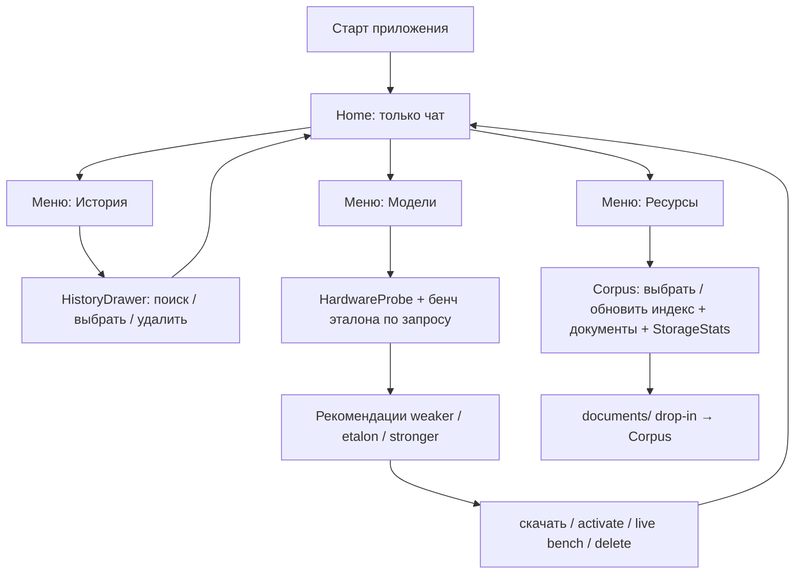
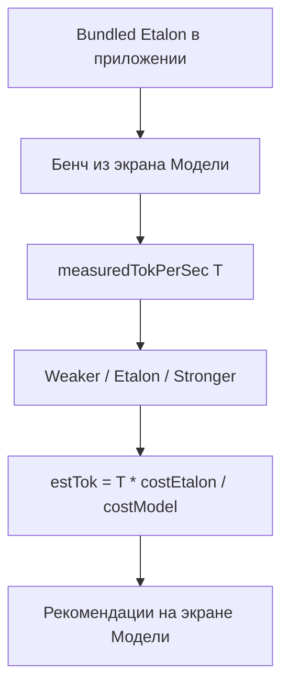
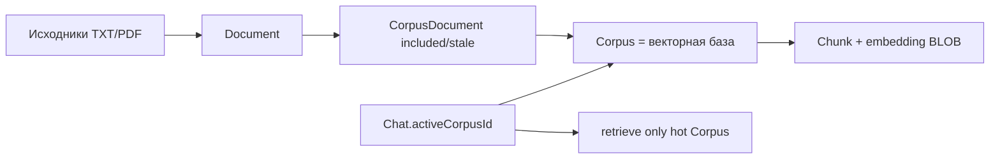

# RAGG — полный поэтапный план

Локальный RAG на Kotlin Multiplatform: профилирование устройства, менеджер моделей с оценкой производительности, **инференс целиком на llama.cpp (GGUF)** для LLM и embedding, документы и **выбираемые векторные базы** по источникам, чат.

**Таргеты сейчас:** Android, Desktop (JVM), iOS (stubs).  
**Позже:** Web/Wasm (FileReader).

**UI-эталон:** интерактивное демо [`docs/demo/`](demo/) (HTML/CSS/JS) — визуал, навигация и паттерны экранов для Compose.

---

## Зафиксированные решения

| Тема | Решение |
|------|---------|
| Каталог моделей | Зашит в приложение (URL HF/зеркало, размер, quant, paramB, minRam, **format**: `gguf`, role: Llm / Embedding) |
| Инференс | **Всё на llama.cpp**: LLM и embedding — GGUF за `LlmEngine` / `EmbeddingEngine` (два контекста; Mock для UI без натива) |
| Почему один стек | Максимум выгоды на phone: mmap + Q4_K, без налога второго рантайма (ORT) на RAM под векторы/KV/большую LLM |
| Оценка скорости | **Якорь = бенч встроенной эталонной GGUF LLM на этом устройстве**; остальные — слабее/сильнее относительно неё |
| Главный экран | **Только чат**: сообщения + ввод; **новый чат** и **сохранить TXT** в шапке |
| Меню (drawer слева) | **История** · **Модели** · **Ресурсы** |
| История | Отдельный **drawer слева** (как меню): поиск, список, удаление чата; выбор → закрыть drawer → открыть чат. Отдельной иконки истории в шапке **нет** |
| Ресурсы | Исходники + **векторные базы (Corpus)**; загрузка / обновление / удаление; drop-in в `documents/` |
| Векторные базы | Несколько **Corpus** (наборов источников); у чата/сессии — **активная база** (или набор); retrieval только по ней |
| Обновление индекса | При add/remove/change источника, смене embedding-модели или составе базы — **инкрементальный** re-embed; полный rebuild при смене dim/модели |
| Хранилище | Размеры исходников + БД эмбеддингов **по каждой Corpus** в Менеджере ресурсов |
| Модели | Экран **Модели**: установленные / каталог; действия **иконками**; здесь же калибровка и рекомендации (не при старте) |
| Старт приложения | **Всегда Home (чат)** по умолчанию; принудительного онбординга моделей **нет** |
| Настройка моделей | Пользователь сам заходит в меню → **Модели** (бенч эталона, рекомендации, скачивание, активация) |
| Эталон в APK | Одна небольшая **GGUF** LLM (`isEtalon`, `bundledInApp`) — калибровка из экрана Модели |
| Embedding-модель | Отдельный **GGUF embed** (маленький multilingual / nomic / bge-small и т.п.); не instruct «вместо» embed |
| Векторный поиск | BLOB в SQLDelight + cosine в Kotlin; working set = чанки **активной Corpus** (бюджет чанков/байт на phone) |
| Лимит исходников | По **извлечённому тексту и числу чанков на Corpus**, не по формату файла; TXT≈текст, PDF дороже на парсинге |
| Ориентация | Только **портрет**; landscape на телефоне — экран-заглушка «поверните устройство» |
| Фон / сворачивание | Состояние переживает сворачивание до **~5 с**; llama-контексты — unload по low-memory; process death — восстановление по БД/флагам |
| Визуал | Оттенки **серого и перламутра**; бренд **RAGG** как сильный сигнал; адаптив phone / desktop |
| DI / сеть / БД / UI | Koin, Ktor, SQLDelight, Compose + Voyager |
| ONNX / прочие backend | Вне скоупа v1; не подключать второй инференс-рантайм |

---

## UI / дизайн (по демо)

Референс: [`docs/demo/`](demo/) — палитра, компоновка, иконки, поведение drawer.

### Визуальный язык

- Фон: перламутровые градиенты / sheen (серо-серебристый, без «фиолетового AI» и без кремово-терракотового клише).
- Поверхности: полупрозрачные карточки, тонкие границы, мягкая тень.
- Типографика: выразительный display для бренда (в демо — Syne), UI-sans для текста (Figtree); в Compose — аналогичный pair, не Inter/Roboto по умолчанию.
- Акценты: нейтральный graphite; статусы — muted green / amber / rose для badge.
- Иконки действий вместо текстовых кнопок там, где действие вторичное (модели, документы, история).

### Адаптив и устройство

| Правило | Детали |
|---------|--------|
| Phone | Портрет; drawer меню и истории на всю высоту слева |
| Desktop | Тот же flow; контент в «окне» приложения; drawer шире (~320px) |
| Поворот | Запрещён (lock portrait + UI-gate) |
| Сворачивание ≤5 с | Сохранить экран/чат; при возврате продолжить без сброса на Home |

### Карта экранов (как в демо)

```text
[старт приложения]
  → Home (чат)   ← всегда по умолчанию

Home (чат)
  шапка: меню | RAGG + название чата | сохранить TXT · новый чат
  тело: сообщения
  низ: composer
  меню → История  → HistoryDrawer (слева) → выбор чата → Home
  меню → Модели   → ModelManagerScreen → закрыть → Home
  меню → Ресурсы  → ResourceManagerScreen → закрыть → Home
```

Настройка железа / бенч / рекомендации / скачивание — **только** внутри экрана **Модели** (по инициативе пользователя), не как ворота перед чатом.

### Home

- Только чат; **нет** списка документов / моделей / storage.
- **Новый чат** (иконка +).
- **Сохранить чат как `.txt`** (иконка рядом с +).
- История **не** в шапке — только через меню.
- Если модели ещё не настроены: чат доступен (mock / подсказка «настройте модели в меню»); вход не блокировать.

### HistoryDrawer

- Тот же паттерн, что меню: выезд **слева**, backdrop, закрытие по backdrop / после выбора.
- Поиск по названию и тексту сообщений.
- Строка чата: открыть · корзина удалить.
- Выбор чата: свернуть drawer и показать выбранный диалог.

### ModelManagerScreen

- Якорь: «это устройство · эталон · N ток/с» или «ещё не калибровано» + действие замерить.
- При отсутствии якоря: проверка мощности / бенч эталона / группы рекомендаций — **здесь**, не на старте.
- Карточка: **название + badge** в одной строке; meta ниже.
- Действия **справа иконками**: активировать, прогнать вживую, удалить; в каталоге — скачать.
- Группы: Установленные / Каталог (и секции рекомендаций после бенча).

### ResourceManagerScreen

- Сверху StorageStats (исходники, БД **по базам**, модели, всего).
- Блок **Векторные базы (Corpus)**: список, создать / переименовать / удалить; **активировать** базу для поиска в текущем чате.
- Подсказка drop-in `documents/` (новые файлы → в выбранную/дефолтную Corpus).
- Заголовок «Документы» + фильтр по активной/выбранной базе + иконки **обновить индекс** и **добавить** справа.
- Строка документа: meta + принадлежность к базе + **корзина**; чекбокс «в этой базе» / перенос между базами.
- Статусы индекса: актуален / устарел / индексация…; кнопка **обновить базу** (инкрементально).

### Лимиты ресурсов (смартфон)

- Целевой объём **на активную Corpus**: порядка **10–20 документов** или жёстче — по `maxChunks` / `maxVectorBytes`.
- Упор: **RAM** (mmap GGUF LLM + краткий embed-контекст llama.cpp + working set векторов активной базы), затем CPU индексации, затем диск.
- Много баз на диске ок; в RAM / cosine — **только активная** (hot-set).
- Лимит знаний = извлечённый текст и чанки; формат (TXT/PDF) влияет на парсинг, не на формулу поиска после индекса.

---

## Целевая архитектура



### Пакеты `sharedLogic`

- `device/` — HardwareProbe, CapabilityScore, lookup-таблицы SoC/GPU
- `models/` — Catalog, PerfEstimator, ModelManager, Downloader
- `cache/` — CachePaths expect/actual
- `db/` — SQLDelight (Corpus, Document, Chunk, Chat, Calibration, …)
- `docs/` — DocumentParser, CorpusIndexer (chunk + embed + incremental update)
- `ai/` — `LlmEngine` + `EmbeddingEngine` (оба llama.cpp/GGUF), Mock
- `di/` — Koin-модули
- `chat/` — история чатов, экспорт TXT, привязка `activeCorpusId`

---

## Старт приложения и настройка моделей

### Поток UX

1. **Запуск** → сразу **Home (чат)**. Без экрана проверки мощности и без мастера скачивания.
2. Меню → **История** (drawer слева: поиск, выбрать, удалить).
3. Меню → **Ресурсы**: StorageStats, документы; иконки обновить / добавить / удалить; drop-in в `documents/`.
4. Меню → **Модели** (когда пользователь сам решил настроить):
   - снять `HardwareProfile` при необходимости;
   - **бенч** встроенной эталонной модели (кнопка / первый заход без якоря);
   - прогресс: «Прогрев…» → «Генерация…» → `N ток/с`;
   - сохранить якорь `Calibration(etalonModelId, backend, tokPerSec, deviceFingerprint)`;
   - показать рекомендации weaker / etalon / stronger;
   - скачать / активировать выбранные (для RAG: embedding + LLM);
   - «Прогнать вживую» обновляет оценку / якорь.
5. Закрыть Модели (✕) → Home.

Отдельного онбординга `PowerCheck → Recommendations → Download → Home` **нет**.

### Встроенная эталонная модель

| Свойство | Решение |
|----------|---------|
| Что | Одна **GGUF** LLM из каталога, `isEtalon = true` |
| Кандидат | Qwen2.5-0.5B-Instruct **Q4_K_M** (или меньше, SmolLM-360M Q4) если размер APK критичен |
| Где лежит | `assets`; при первом бенче из экрана Модели копируется в `CachePaths/models` при необходимости |
| Embedding | Отдельный GGUF embed (bundled маленький или download) через тот же llama.cpp |
| Backend | Один натив llama.cpp; два контекста: `genCtx` (LLM) и `embedCtx` (embedding); n_threads от cores; mmap; без лишней GPU на mid Mali |

Эталон доступен без сети для калибровки; ранжирование остальных — **после** бенча в Моделях.

### Ранжирование «слабее / сильнее»

После бенча эталона с `measuredTokPerSec = T`:

```text
relativeClass(model) =
  Weaker   если cost(model) < cost(etalon)
  Etalon   если model.id == etalon.id
  Stronger если cost(model) > cost(etalon)

estTok(model) = T * cost(etalon) / cost(model)

comfort =
  Comfortable если estTok >= minComfortTokPerSec  // напр. 3.0
  Slow        если 1.0 .. minComfort
  Impractical если < 1.0 или fit == Insufficient
```

UI-группы **на экране Модели** (после калибровки):

- **Рекомендуем** — Etalon и/или Weaker с Comfortable + Fits (и нужный embedding).
- **Можно сильнее** — Stronger с Fits и не Impractical; бейдж «медленнее эталона на ~X%».
- **Не стоит** — Insufficient / Impractical (свёрнуто или disabled).

«Скачать рекомендованный набор» = embedding + лучший Comfortable LLM (часто эталон — только активировать).

### Состояния калибровки (экран Модели)

```kotlin
sealed interface CalibrationUiState {
  data object NotCalibrated : CalibrationUiState
  data object PreparingHardware : CalibrationUiState
  data class Benchmarking(val phase: String, val progress: Float?) : CalibrationUiState
  data class Ready(
    val profile: HardwareProfile,
    val etalonTokPerSec: Float,
    val groups: RecommendationGroups,
  ) : CalibrationUiState
  data class Error(val message: String) : CalibrationUiState
}
```

Якорь: `Calibration` с текущим `deviceFingerprint`. Флаг «онбординг завершён» **не нужен** — старт всегда Home.

---
## Этап 0 — Каркас зависимостей и DI

**Цель:** проект собирается с нужными библиотеками, Koin стартует на Android и Desktop; заготовки под натив llama.cpp без обязательной линковки в этом этапе.

### Работы

1. Версии в [`gradle/libs.versions.toml`](../gradle/libs.versions.toml):
   - Koin (core + compose)
   - Ktor Client (OkHttp Android, CIO Desktop) + ContentNegotiation
   - kotlinx.serialization
   - SQLDelight (+ драйверы Android / JDBC)
   - Voyager (navigator, screen model / tabs)
   - kotlinx-coroutines-core в common
2. Подключить зависимости в `sharedLogic` / `sharedUI`.
3. `initKoin { modules(platformModule, networkModule, …) }` из `MainActivity` и Desktop `main`.
4. Заготовки модулей: `platformModule`, `networkModule`, `databaseModule`, `aiModule` (Mock engines), `modelsModule`.
5. Заложить структуру `ai/llama` (expect/actual / JNI stubs, CMake) — реальная линковка в этапах 3/6.

### Критерий готовности

- Приложение запускается; Koin резолвит хотя бы `HttpClient` и заглушку `HardwareProbe`.

---

## Этап 1 — Профилирование железа

**Цель:** на телефоне и ПК получать CPU, RAM, GPU в едином `HardwareProfile`.

### Контракт (common)

```kotlin
data class HardwareProfile(
  val platform: PlatformKind, // Android, Desktop, Ios
  val ram: RamInfo,           // totalMb, availableMb
  val cpu: CpuInfo,           // cores, performanceCores?, maxFreqMhz?, name?, abi?
  val gpu: GpuInfo,           // name, api, vramMbHint?
  val socOrChipset: String?,
)

data class CapabilityScore(
  val cpuScore: Float,  // относительный балл только для tier/fit/ранжирования до калибровки
  val gpuScore: Float,  // 0 = GPU для LLM бесполезен
  val ramScore: Float,
  val tier: DeviceTier, // Low, Mid, High, DesktopHigh
)
```

> **Важно:** `CapabilityScore` не является эталоном tok/s. Эталон производительности — **калибровка на этом же устройстве** (см. этап 2–3).

### Android (`actual`)

| Параметр | Источник |
|----------|----------|
| RAM | `ActivityManager.MemoryInfo` |
| CPU cores | `Runtime.availableProcessors()` |
| CPU freq | `/sys/.../cpufreq/cpuinfo_max_freq` (best-effort) |
| SoC | `Build.SOC_MODEL` / `BOARD` / `HARDWARE` |
| GPU | GLES `GL_RENDERER` (EGL) |
| API | Vulkan / NNAPI feature flags |
| ABI | `Build.SUPPORTED_ABIS` |

### Desktop (`actual`)

| Параметр | Источник |
|----------|----------|
| RAM | `OperatingSystemMXBean` |
| CPU | cores, `os.arch`, Linux `/proc/cpuinfo` |
| GPU | Vulkan-устройства (LWJGL/JNI); fallback GL / `lspci` / CIM |
| VRAM | Vulkan heaps при наличии |

### iOS (`actual` stub)

- `NSProcessInfo` physicalMemory + processorCount, Metal hint.

### Lookup-таблицы

- `KnownSocTable` — например Helio G95 → cpu≈35, gpu≈15 (LLM → CPU).
- `KnownGpuTable` — Mali-G7x, Adreno 6xx/7xx, NVIDIA/AMD desktop.
- Неизвестный чип → эвристика по cores/freq/имени GPU.

### Скоринг (только tier / fit / выбор backend до калибровки)

Нормализация по внутренним константам железа (cores/freq/RAM) — **не** заявка на абсолютный tok/s.

```text
cpuScore = 0.45*norm(cores) + 0.35*norm(freq) + 0.20*socBoost
gpuScore = 0 если непригоден для LLM, иначе lookup/heuristic
preferredBackend = CPU на mid Mali; GPU на desktop если gpuScore > cpuScore*1.2
```

### Критерий готовности

- Unit-тесты: профиль mid-phone 6GB → Mid; desktop 16GB+8c → DesktopHigh/High.
- На Android/Desktop в лог/debug виден заполненный `HardwareProfile`.

---

## Этап 2 — Каталог моделей и оценка производительности

**Цель:** для каждой модели — fit по RAM и ориентир `~tok/с` / ms для embedding.

### ModelCatalog (bundled)

Поля артефакта: `id`, `displayName`, `role` (Embedding/Llm), `format` (`gguf`), `sizeBytes`, `minRamMb`, `paramBillions`, `quantBits` / `quantName` (напр. Q4_K_M), `contextLength`, `approxLayers`, `embeddingDim?`, `downloadUrl`, `sha256?`, `languages`, **`isEtalon`**, **`bundledInApp`**.

Стартовый набор (всё GGUF):

- **Etalon (bundled):** одна LLM Q4 (0.5B или меньше) — `isEtalon=true`, `bundledInApp=true`, `role=Llm`
- **Embedding:** маленький multilingual / nomic / bge-small GGUF (bundled или download), `role=Embedding`
- Сильнее: Qwen2.5-1.5B Q4_K_M и др. (только download), `role=Llm`
- Слабее эталона: если эталон 0.5B — опционально 360M; если эталон уже самый маленький — группа «слабее» пустая

**RAM fit (телефон):** mmap GGUF (рабочий RSS < sizeBytes) + headroom под активную Corpus + краткий `embedCtx`; не суммировать «полный размер файла = RAM». LLM и embed **не** держать оба тяжёлыми контекстами без нужды.

### PerfEstimator — якорь = бенч эталона на устройстве



**RAM fit** — от текущего `availableRamMb` (как раньше).

**tok/s** — от якоря эталона после бенча в Моделях (High для эталона, Medium для scale). Пока бенч не прогнан — в каталоге fit по RAM + пометка «без якоря»; не гнать пользователя на отдельный стартовый экран.

Повторный бенч / «Прогнать вживую» в Моделях обновляет якорь.

### ModelFitCard

```kotlin
data class ModelFitCard(
  val model: ModelArtifact,
  val fit: FitLevel,
  val preferredBackend: InferBackend,
  val estimatedTokPerSec: ClosedFloatingPointRange<Float>?,
  val estimatedEmbedMs: ClosedFloatingPointRange<Float>?,
  val reason: String,
  val confidence: Confidence,
  val localStatus: LocalModelStatus,
)
```

### Тесты

- Fit по RAM: mid 6GB → 0.5B Fits; 3B Tight/Insufficient.
- После бенча эталона T=5.0 → Weaker/Stronger классы и scale `estTok` от T.
- `bundledInApp` эталон доступен без сети для `runEtalonBenchmark()`.
- Чужой `deviceFingerprint` игнорируется.

### Критерий готовности

- `PerfEstimator.estimate(profile, catalog)` возвращает карточки без UI.

---

## Этап 3 — Кэш, загрузка и Model Manager (логика)

**Цель:** скачивание, учёт установленных моделей, активация, калибровка.

### CachePaths (expect/actual)

- Android: `filesDir/models`, `filesDir/documents`
- JVM: `~/.cache/ragg/...`
- iOS: Application Support

### ModelDownloader (Ktor)

- Проверка локального файла (размер / sha256).
- Download во `.tmp` → rename.
- `Flow<DownloadProgress>`.
- URL из каталога (HF или свой baseUrl).

### SQLDelight (модели)

- `InstalledModel(id, path, bytes, sha256, role, active, …)`
- `Calibration(modelId, backend, tokPerSec, deviceFingerprint, measuredAt)`

### ModelManager (facade)

```kotlin
fun observeCards(): Flow<List<ModelFitCard>>
suspend fun runEtalonBenchmark(): Float          // калибровка из экрана Модели
fun recommendations(): RecommendationGroups      // weaker / etalon / stronger
suspend fun download(modelId: String)
suspend fun cancel(modelId: String)
suspend fun delete(modelId: String)
suspend fun setActive(modelId: String)
suspend fun runBenchmark(modelId: String): Float // живой прогон + оценка
```

Эталон GGUF с `bundledInApp` копируется из assets в cache при первом бенче из Моделей при необходимости. Скачивание — только GGUF; различает `role=Llm` и `role=Embedding`.

`StorageStatsProvider.stats(): StorageStats` — показ в **Ресурсах** (позже per-Corpus).
### Калибровка (якорь = бенч эталона на устройстве)

1. Пользователь открывает **Модели** (не обязательный шаг при старте).
2. Бенч **bundled etalon** → запись `Calibration(...)`.
3. Каталог ранжируется: weaker / etalon / stronger + comfort от `estTok`.
4. Повторный «Замерить» / «Прогнать вживую» обновляет якорь.
5. UI: «Ориентир: это устройство · эталон &lt;id&gt; · N ток/с» или «ещё не калибровано».

### Критерий готовности

- Без сети: из Моделей прогон бенча эталона из assets → якорь в БД → список weaker/stronger.
- С сетью: скачивание выбранных моделей в кэш, activate.
- Старт приложения при этом всегда открывает Home, не Модели.

---

## Этап 4 — UI: Home (чат), меню, Модели / Ресурсы

**Цель:** старт с чата; история / модели / ресурсы — из меню. Визуал и IA — по [`docs/demo/`](demo/). Принудительного онбординга моделей нет.

### HomeScreen (главный — открывается при старте)

- Шапка: **меню** · бренд RAGG + название чата · **сохранить TXT** · **новый чат**.
- Сообщения + composer + стриминг (`ChatState`).
- На Home **нет** списка документов, моделей, storage, **нет** иконки истории.
- Без настроенных моделей — не блокировать; подсказка зайти в меню → Модели.

### Меню (drawer слева)

| Пункт | Поведение |
|-------|-----------|
| История | `HistoryDrawer` слева (поиск / список / удалить) → выбор → pop drawer → чат |
| Модели | `ModelManagerScreen` → закрыть (✕) → Home |
| Ресурсы | `ResourceManagerScreen` → закрыть (✕) → Home |
| (позже) Настройки / о приложении | — |

### HistoryDrawer

1. Поиск по названию и тексту сообщений.
2. Список чатов: открыть / удалить (корзина).
3. Выбор чата закрывает drawer и показывает диалог на Home.

### ModelManagerScreen (вся настройка моделей)

1. Якорь устройства или состояние «не калибровано» + бенч эталона.
2. Рекомендации weaker / etalon / stronger после калибровки; скачивание набора.
3. Установленные: иконки activate / «прогнать вживую» / delete; badge у названия.
4. Каталог: иконка скачать.
5. Отдельного `DevicePowerCheckScreen` как первого экрана приложения **нет** — логика калибровки встроена сюда.

### ResourceManagerScreen

1. **StorageStats:** исходники / БД (сумма и **per-Corpus**) / модели / всего.
2. **Векторные базы:** список Corpus; создать / переименовать / удалить; **сделать активной** (для текущего чата / дефолт).
3. Подсказка drop-in `documents/` → файлы попадают в выбранную базу (или Default).
4. «Документы» (фильтр по базе) + иконки **обновить индекс** и **добавить**.
5. Строка: статус индексации, размер, база; перенос/вкл в базе; **корзина** — удалить файл + чанки; при необходимости пометить Corpus `stale`.
6. **Обновить базу:** инкрементальный пересчёт устаревших документов; полный rebuild — при смене embedding-модели или ручном «Пересобрать».

> Выбор и обновление векторных баз — **часть этапов 4–6**, не отложенная перспектива. Hot-set retrieval = активная Corpus (на phone критично для RAM).

### Навигация

```text
[старт]       Home (чат)
                ├─ меню → HistoryDrawer → select chat → Home
                ├─ меню → ModelManager → закрыть → Home
                └─ меню → ResourceManager (Corpus + docs) → закрыть → Home
```

### Критерий готовности

- Приложение стартует на Home; онбординг-моделей нет.
- История только из меню-drawer; Модели/Ресурсы — закрыть ✕.
- В Ресурсах виден список Corpus и переключение активной базы (хотя бы UI + заглушка данных).
- Калибровка и скачивание доступны из Моделей.
- Портрет; UI соответствует демо по структуре экранов.

---

## Этап 5 — Менеджер ресурсов, Corpus, drop-in, учёт размера

**Цель:** исходники и **несколько векторных баз**; выбор активной базы; инкрементальное обновление индекса; StorageStats.

### CachePaths / DocumentsDir

- `…/documents` — drop-in + файлы из «Загрузить» (физически общие; логическая привязка к Corpus в БД).
- `DocumentWatcher` / scan при открытии Resource Manager и по «Обновить».

### Модель данных (SQLDelight)

```text
Corpus(id, title, embeddingModelId, createdAt, updatedAt, status, chunkCount, vectorBytes)
Document(id, title, sourcePath, sourceBytes, createdAt, contentHash, status)
CorpusDocument(corpusId, documentId, included, indexedRevision, stale)
Chunk(id, corpusId, documentId, ordinal, text, embedding BLOB, embedRevision)
Chat(..., activeCorpusId)   // какая база участвует в RAG этого чата
```

- Один документ может входить в **несколько** Corpus (или копироваться политикой v1: 1 doc → 1 corpus — упрощение допустимо, схема выше предпочтительнее).
- `stale` / `indexedRevision` ≠ `embedRevision` → база нуждается в обновлении.
- Смена `embeddingModelId` у Corpus → все чанки этой базы `stale` → полный re-embed базы.

### CorpusIndexer

```kotlin
interface CorpusIndexer {
  suspend fun addDocuments(corpusId: String, paths: List<String>)
  suspend fun removeDocument(corpusId: String, documentId: String)
  suspend fun setIncluded(corpusId: String, documentId: String, included: Boolean)
  suspend fun refresh(corpusId: String)          // инкремент: только stale
  suspend fun rebuild(corpusId: String)          // полный re-embed
  fun observeCorpus(corpusId: String): Flow<CorpusStats>
}
```

Политика phone:

- cosine / working set только для `Chat.activeCorpusId` (и `included=true`);
- бюджеты на Corpus: `maxChunks`, `maxVectorBytes`, `maxExtractedChars` — отказ с понятной ошибкой;
- векторы в BLOB: предпочтительно **float16 или int8**;
- chunking: зафиксировать `chunkTokens` / `overlap` (ориентир 256–384 / 10–15%).

### StorageStats

```kotlin
data class StorageStats(
  val sourcesBytes: Long,
  val databaseBytes: Long,
  val modelsBytes: Long,
  val totalBytes: Long,
  val perCorpus: List<CorpusStorageRow>, // vectorBytes, chunkCount, staleCount
)
```

### DocumentParser + поиск

- TXT потоково; PDF следом.
- Retrieval: кандидаты активной Corpus → (опц. FTS) → cosine top‑k → контекст в LLM.
- Лимит — по чанкам/байтам **активной** базы; архив других Corpus на диске не грузится в RAM.

### Критерий готовности

- CRUD Corpus; назначение документов; активная база на чате.
- Refresh обновляет только stale; rebuild — полная пересборка векторов базы.
- Drop-in → документ в выбранной/Default Corpus.
- StorageStats отражает исходники и БД per-Corpus.

---

## Этап 6 — Чат и AI-движки (llama.cpp)

**Цель:** RAG-чат со стримингом; LLM и embedding через llama.cpp/GGUF; поиск по активной Corpus.

### Абстракции

```kotlin
interface EmbeddingEngine {
  suspend fun embed(texts: List<String>): List<FloatArray>
}
interface LlmEngine {
  fun complete(prompt: String): Flow<String>
}
class MockLlmEngine : LlmEngine
class MockEmbeddingEngine : EmbeddingEngine
class LlamaCppLlmEngine(...) : LlmEngine           // GGUF instruct, mmap, streaming
class LlamaCppEmbeddingEngine(...) : EmbeddingEngine // GGUF embed, отдельный embedCtx
```

### Жизненный цикл (phone)

| Фаза | Резидентно | Выгрузить |
|------|------------|-----------|
| Индексация / refresh Corpus | `embedCtx` (+ веса embed GGUF) | `genCtx` / LLM |
| Чат: embed query | `embedCtx` кратко | после query-вектора — free/unload emb |
| Чат: generate | `genCtx` (LLM GGUF, mmap) | emb |
| Low memory / фон | минимум | оба контекста |

Не держать instruct и embed контексты активными одновременно без нужды — экономия под векторный working set.

### ChatState

```kotlin
sealed interface ChatState {
  data object Idle : ChatState
  data object Loading : ChatState
  data class Streaming(val text: String) : ChatState
  data class Error(val message: String) : ChatState
}
```

### UI

- **HomeScreen** — чат; в meta/шапке или через Ресурсы — какая **активная база** (название Corpus).
- **HistoryDrawer** — из меню; поиск; выбор закрывает drawer.
- `ChatScreenModel`: `chatState`, `activeCorpusId`, история, экспорт TXT.
- Меню → История / Model Manager / Resource Manager.

### Натив

- **Один** runtime llama.cpp (Android/Desktop JNI + CMake, ABI splits).
- Два logical engine: load GGUF по `role`; bench LLM → Calibration; embed-ms → `ModelFitCard.estimatedEmbedMs`.
- Каталог: все артефакты `format=gguf`; роли не смешивать (instruct ≠ embedding-модель).

### Навигация Voyager

```text
Start → Home
Home → HistoryDrawer | ModelManager | ResourceManager → закрыть → Home
```

### Критерий готовности

- Mock-чат на Home; TXT; история из меню.
- С нативом: RAG по **активной Corpus** (embed GGUF → retrieve → LLM GGUF stream).
- Калибровка эталона GGUF только в Моделях; UI как в демо.

---

## Этап 7 — Укрепление и полировка

1. PDF-парсинг на Android и Desktop.
2. Стабильный llama.cpp: streaming, бенч, n_threads / ctx / mmap; раздельные `genCtx` / `embedCtx`.
3. FTS-гибрид (ключевые слова + вектор) **внутри активной Corpus**.
4. Compose UI: паритет с [`docs/demo/`](demo/); UI Corpus (создать / активировать / обновить / stale badge).
5. README: стек llama.cpp/GGUF, тиры, лимиты Corpus, как добавить модель в каталог, SoC-таблица.
6. Расширение `KnownSocTable` / `KnownGpuTable` по мере тестов.
7. (Опционально) GPU/Vulkan offload на desktop; на mid-phone CPU-first.
8. (Опционально) Web: FileReader + Wasm-таргет.

---

## Вне скоупа первой поставки (этапы 0–6)

- Полноценный Wasm/Web
- ONNX Runtime / второй инференс-backend
- Облачный каталог моделей (остаётся bundled)
- Полный офлайн-бенч всех чипсетов мира (только таблицы + калибровка)
- Облачный/удалённый векторный индекс

---

## Векторные базы и источники (продуктовая модель)



1. Пользователь создаёт базы («Работа», «Учёба», …) в Менеджере ресурсов.
2. Источники добавляются в базу (или несколько); drop-in → текущая/Default.
3. **Активная база** выбирается для чата (и запоминается в `Chat.activeCorpusId`).
4. **Обновить базу** — `CorpusIndexer.refresh`: пересчёт чанков/эмбеддингов только для `stale` / новых / изменённых (`contentHash`).
5. Смена embedding-модели или «Пересобрать» — `rebuild` этой Corpus; другие базы не трогаем.
6. StorageStats и лимиты phone считаются **per-Corpus**; в RAM — только активная.

Это закрывает и «разные источники», и контроль объёма эмбеддингов без обязательной одной огромной матрицы.

## Сводка этапов

| Этап | Название | Результат |
|------|----------|------------|
| 0 | Зависимости + Koin | Сборка и DI |
| 1 | HardwareProbe + Score | Профиль CPU/RAM/GPU |
| 2 | Catalog + PerfEstimator | GGUF etalon, weaker/stronger, scale от бенча |
| 3 | Cache + Downloader + Manager API | Bundled GGUF etalon, якорь, скачивание |
| 4 | Home-чат + меню | Старт → Home; UI Corpus-заготовки в Ресурсах |
| 5 | Resource Manager + Corpus + StorageStats | Базы, источники, refresh/rebuild, размеры |
| 6 | Chat + llama.cpp engines | GGUF embed + GGUF LLM; RAG по активной базе |
| 7 | Полировка | PDF, FTS, UX Corpus, docs |

---

## Пример сценария (Helio G95, 6+2 ГБ)

1. Запуск → сразу **Home (чат)**; модели ещё можно не трогать.
2. Меню → Модели → бенч bundled GGUF etalon (0.5B Q4_K) → например **5–8 ток/с** (mmap).
3. Эталон = база; сильнее (1.5B) — оценка ниже; скачать embed-GGUF + нужный LLM-GGUF.
4. ✕ → Home; меню → Ресурсы: создать Corpus «Работа», загрузить TXT, **обновить базу**; размеры per-Corpus.
5. Сделать Corpus активной для чата; второй набор документов — в другой базе (на диске, не в RAM).
6. Чат: embed query (llama.cpp) → retrieve по активной базе → ответ LLM stream (llama.cpp).
7. Меню → История: поиск, выбор чата; сохранение диалога в TXT.
