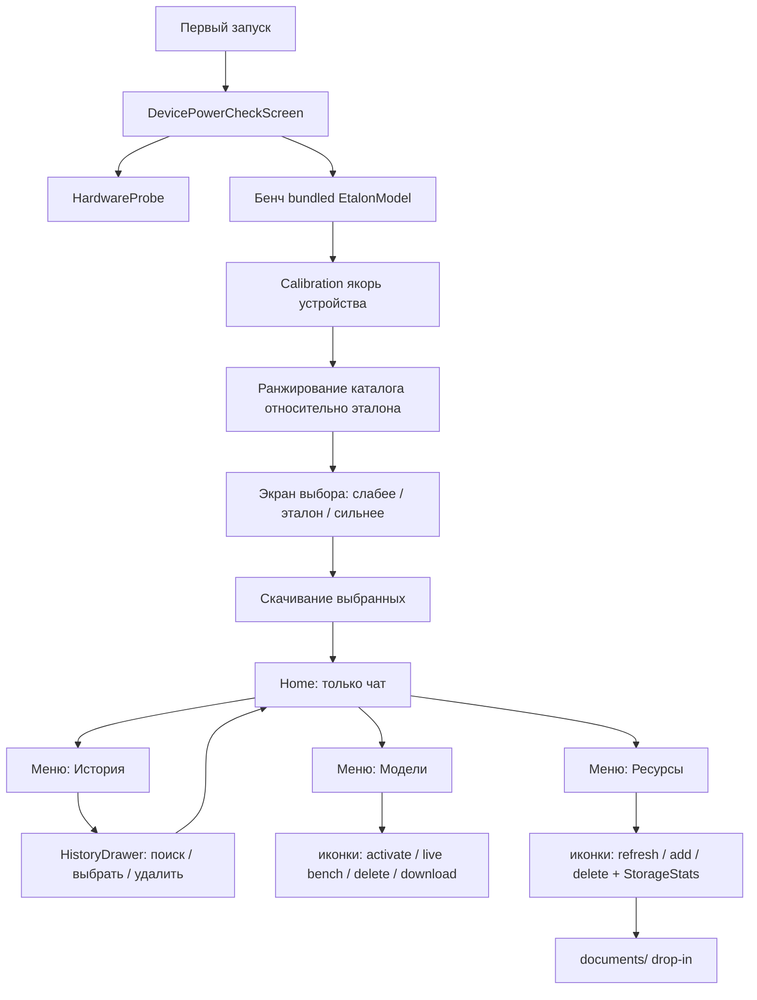
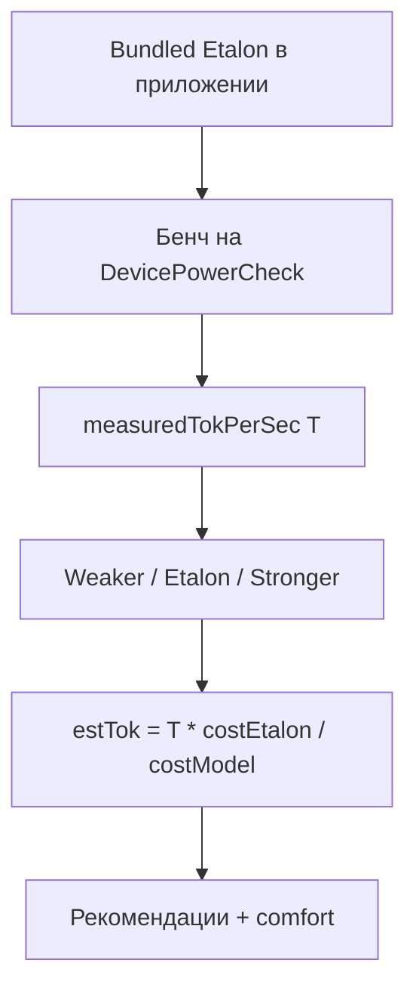

# RAGG — полный поэтапный план

Локальный RAG на Kotlin Multiplatform: профилирование устройства, менеджер моделей с оценкой производительности, загрузка ONNX, документы, чат.

**Таргеты сейчас:** Android, Desktop (JVM), iOS (stubs).  
**Позже:** Web/Wasm (FileReader).

**UI-эталон:** интерактивное демо [`docs/demo/`](demo/) (HTML/CSS/JS) — визуал, навигация и паттерны экранов для Compose.

---

## Зафиксированные решения

| Тема | Решение |
|------|---------|
| Каталог моделей | Зашит в приложение (URL HF/зеркало, размер, quant, paramB, minRam) |
| Инференс | ONNX Runtime за `LlmEngine` / `EmbeddingEngine` |
| Оценка скорости | **Якорь = бенч встроенной эталонной модели на этом устройстве**; остальные модели — слабее/сильнее относительно неё |
| Главный экран | **Только чат**: сообщения + ввод; **новый чат** и **сохранить TXT** в шапке |
| Меню (drawer слева) | **История** · **Модели** · **Ресурсы** |
| История | Отдельный **drawer слева** (как меню): поиск, список, удаление чата; выбор → закрыть drawer → открыть чат. Отдельной иконки истории в шапке **нет** |
| Ресурсы | Загрузка / обновление / удаление в Resource Manager; drop-in в `documents/` |
| Контекст поиска (v1) | В первой поставке в retrieval участвуют **все** проиндексированные документы |
| Контекст поиска (перспектива) | Выбор подмножества документов для поиска + **пересчёт / обновление** чанков, векторов и эмбеддингов |
| Хранилище | Размеры исходников + БД эмбеддингов в **Менеджере ресурсов** |
| Модели | Model Manager: установленные / каталог; действия **иконками** (активировать, прогон, удалить, скачать) |
| Первый запуск | Проверка мощности → бенч эталона → рекомендации → скачивание → Home (чат) |
| Эталон в APK | Одна небольшая LLM (`isEtalon`, `bundledInApp`) |
| Векторный поиск | BLOB в SQLDelight + cosine в Kotlin (**10–20 документов**) |
| Лимит исходников | По **извлечённому тексту и числу чанков**, не по формату файла; TXT≈текст, PDF дороже на парсинге |
| Ориентация | Только **портрет**; landscape на телефоне — экран-заглушка «поверните устройство» |
| Фон / сворачивание | Состояние переживает сворачивание до **~5 с** (process death дольше — восстановление по БД/флагам) |
| Визуал | Оттенки **серого и перламутра**; бренд **RAGG** как сильный сигнал; адаптив phone / desktop |
| DI / сеть / БД / UI | Koin, Ktor, SQLDelight, Compose + Voyager |
| llama.cpp | Позже, та же абстракция `LlmEngine` |

---

## UI / дизайн (по демо)

Референс: [`docs/demo/`](demo/) — палитра, компоновка, иконки, поведение drawer.

### Визуальный язык

- Фон: перламутровые градиенты / sheen (серо-серебристый, без «фиолетового AI» и без кремово-терракотового клише).
- Поверхности: полупрозрачные карточки, тонкие границы, мягкая тень.
- Типографика: выразительный display для бренда (в демо — Syne), UI-sans для текста (Figtree); в Compose — аналогичный pair, не Inter/Roboto по умолчанию.
- Акценты: нейтральный graphite; статусы — muted green / amber / rose для badge.
- Иконки действий вместо текстовых кнопок там, где действие вторичное (модели, документы, история).

### Адаптив и устройство

| Правило | Детали |
|---------|--------|
| Phone | Портрет; drawer меню и истории на всю высоту слева |
| Desktop | Тот же flow; контент в «окне» приложения; drawer шире (~320px) |
| Поворот | Запрещён (lock portrait + UI-gate) |
| Сворачивание ≤5 с | Сохранить экран/чат/онбординг-флаги; при возврате продолжить без сброса онбординга |

### Карта экранов (как в демо)

```text
[онбординг, один раз]
  PowerCheck → Recommendations → Download → Home

[после онбординга]
  Home (чат)
    шапка: меню | RAGG + название чата | сохранить TXT · новый чат
    тело: сообщения
    низ: composer
    меню → История          → HistoryDrawer (слева) → выбор чата → Home
    меню → Модели → ModelManagerScreen → закрыть → Home
    меню → Ресурсы → ResourceManagerScreen → закрыть → Home
```

### Home

- Только чат; **нет** списка документов / моделей / storage.
- **Новый чат** (иконка +).
- **Сохранить чат как `.txt`** (иконка рядом с +).
- История **не** в шапке — только через меню.

### HistoryDrawer

- Тот же паттерн, что меню: выезд **слева**, backdrop, закрытие по backdrop / после выбора.
- Поиск по названию и тексту сообщений.
- Строка чата: открыть · корзина удалить.
- Выбор чата: свернуть drawer и показать выбранный диалог.

### ModelManagerScreen

- Якорь: «это устройство · эталон · N ток/с».
- Карточка: **название + badge** (embedding / эталон / быстрее / медленнее / не стоит) в одной строке; meta ниже.
- Действия **справа иконками**: активировать, прогнать вживую, удалить; в каталоге — скачать.
- Группы: Установленные / Каталог.

### ResourceManagerScreen

- Сверху StorageStats (исходники, БД, модели, всего).
- Подсказка drop-in `documents/`.
- Заголовок «Документы» + иконки **обновить** и **добавить** справа (нижнего dock нет).
- Строка документа: meta + **корзина** удалить.

### Онбординг (продукт; в демо можно скипать)

Экраны Power / Recommendations / Download остаются в поставке KMP; демо для удобства стартует с Home. Compose реализует полный поток первого запуска.

### Лимиты ресурсов (смартфон)

- Целевой объём: **10–20 документов**.
- Упор: **RAM** (LLM + embedding + in-memory cosine), затем CPU индексации, затем диск.
- Лимит знаний = объём **извлечённого текста** и чанков; формат (TXT/PDF) влияет на стоимость парсинга, не на формулу поиска после индекса.

---

## Целевая архитектура



### Пакеты `sharedLogic`

- `device/` — HardwareProbe, CapabilityScore, lookup-таблицы SoC/GPU
- `models/` — Catalog, PerfEstimator, ModelManager, Downloader
- `cache/` — CachePaths expect/actual
- `db/` — SQLDelight
- `docs/` — DocumentParser
- `ai/` — LlmEngine, EmbeddingEngine, Mock
- `di/` — Koin-модули
- `chat/` — история чатов, экспорт TXT

---

## Экраны и логика первого запуска

### Поток UX

1. **Включили приложение впервые** → `DevicePowerCheckScreen` («Проверка мощности устройства»).
2. Параллельно/сразу: снять `HardwareProfile` (CPU/RAM/GPU) и показать краткую карточку железа.
3. **Автозапуск бенчмарка** на **встроенной эталонной модели** (уже в приложении, сеть не нужна).
   - Прогресс: «Прогрев…» → «Генерация…» → результат `N ток/с`.
4. Сохранить якорь: `Calibration(etalonModelId, backend, tokPerSec, deviceFingerprint)`.
5. **Экран результатов / рекомендаций** относительно эталона:
   - эталон = «база» (то, что уже есть / только что замерили);
   - модели **слабее** эталона — быстрее, проще, меньше RAM (если есть в каталоге);
   - модели **сильнее** эталона — умнее, но медленнее / тяжелее; показывать только если fit + прогноз tok/s выше порога комфорта (или с явным предупреждением).
6. Пользователь отмечает набор (минимум: embedding + LLM) → скачивание с прогрессом.
7. Онбординг завершён → **Home = только чат** (новый чат / сохранить TXT; история — из меню).
8. Меню → **История** (drawer слева: поиск, выбрать, удалить).
9. Меню → **Модели**: установленные / каталог; иконки activate / live bench / delete / download.
10. Меню → **Ресурсы**: StorageStats, документы; иконки обновить / добавить / удалить; drop-in в `documents/`.

### Встроенная эталонная модель

| Свойство | Решение |
|----------|---------|
| Что | Одна LLM из каталога, помечена `isEtalon = true` |
| Кандидат | Qwen2.5-0.5B-Instruct INT4 **или** ещё меньшая (SmolLM-360M) если размер APK критичен |
| Где лежит | `assets` / ресурсы приложения; при первом бенче копируется в `CachePaths/models` при необходимости |
| Embedding | Можно бандлить маленький MiniLM тоже, либо скачать сразу после бенча как «обязательный» |

Эталон **уже предложен** пользователю: он в приложении; относительно него ранжируются остальные.

### Ранжирование «слабее / сильнее»

После бенча эталона с `measuredTokPerSec = T`:

```text
relativeClass(model) =
  Weaker   если cost(model) < cost(etalon)   // быстрее ожидаемо
  Etalon   если model.id == etalon.id
  Stronger если cost(model) > cost(etalon)

estTok(model) = T * cost(etalon) / cost(model)

comfort =
  Comfortable если estTok >= minComfortTokPerSec  // напр. 3.0
  Slow        если 1.0 .. minComfort
  Impractical если < 1.0 или fit == Insufficient
```

UI-группы на экране рекомендаций:

- **Рекомендуем** — Etalon и/или Weaker с Comfortable + Fits (и всегда нужный embedding).
- **Можно сильнее** — Stronger с Fits и не Impractical; бейдж «медленнее эталона на ~X%».
- **Не стоит** — Insufficient / Impractical (свёрнуто или disabled).

Кнопка по умолчанию: «Скачать рекомендованный набор» = active embedding + лучший Comfortable LLM (часто сам эталон, если он уже локальный — только активировать).

### Состояния онбординга

```kotlin
sealed interface PowerCheckState {
  data object PreparingHardware : PowerCheckState
  data class Benchmarking(val phase: String, val progress: Float?) : PowerCheckState
  data class Results(
    val profile: HardwareProfile,
    val etalonTokPerSec: Float,
    val groups: RecommendationGroups, // weaker / etalon / stronger
  ) : PowerCheckState
  data class Error(val message: String) : PowerCheckState
}
```

Флаг `DeviceBenchmarkStore.onboardingCompleted` + наличие якоря с текущим `deviceFingerprint`.

---

## Этап 0 — Каркас зависимостей и DI

**Цель:** проект собирается с нужными библиотеками, Koin стартует на Android и Desktop.

### Работы

1. Версии в [`gradle/libs.versions.toml`](../gradle/libs.versions.toml):
   - Koin (core + compose)
   - Ktor Client (OkHttp Android, CIO Desktop) + ContentNegotiation
   - kotlinx.serialization
   - SQLDelight (+ драйверы Android / JDBC)
   - Voyager (navigator, screen model / tabs)
   - kotlinx-coroutines-core в common
2. Подключить зависимости в `sharedLogic` / `sharedUI`.
3. `initKoin { modules(platformModule, networkModule, …) }` из `MainActivity` и Desktop `main`.
4. Заготовки модулей: `platformModule`, `networkModule`, `databaseModule`, `aiModule`, `modelsModule`.

### Критерий готовности

- Приложение запускается; Koin резолвит хотя бы `HttpClient` и заглушку `HardwareProbe`.

---

## Этап 1 — Профилирование железа

**Цель:** на телефоне и ПК получать CPU, RAM, GPU в едином `HardwareProfile`.

### Контракт (common)

```kotlin
data class HardwareProfile(
  val platform: PlatformKind, // Android, Desktop, Ios
  val ram: RamInfo,           // totalMb, availableMb
  val cpu: CpuInfo,           // cores, performanceCores?, maxFreqMhz?, name?, abi?
  val gpu: GpuInfo,           // name, api, vramMbHint?
  val socOrChipset: String?,
)

data class CapabilityScore(
  val cpuScore: Float,  // относительный балл только для tier/fit/ранжирования до калибровки
  val gpuScore: Float,  // 0 = GPU для LLM бесполезен
  val ramScore: Float,
  val tier: DeviceTier, // Low, Mid, High, DesktopHigh
)
```

> **Важно:** `CapabilityScore` не является эталоном tok/s. Эталон производительности — **калибровка на этом же устройстве** (см. этап 2–3).

### Android (`actual`)

| Параметр | Источник |
|----------|----------|
| RAM | `ActivityManager.MemoryInfo` |
| CPU cores | `Runtime.availableProcessors()` |
| CPU freq | `/sys/.../cpufreq/cpuinfo_max_freq` (best-effort) |
| SoC | `Build.SOC_MODEL` / `BOARD` / `HARDWARE` |
| GPU | GLES `GL_RENDERER` (EGL) |
| API | Vulkan / NNAPI feature flags |
| ABI | `Build.SUPPORTED_ABIS` |

### Desktop (`actual`)

| Параметр | Источник |
|----------|----------|
| RAM | `OperatingSystemMXBean` |
| CPU | cores, `os.arch`, Linux `/proc/cpuinfo` |
| GPU | Vulkan-устройства (LWJGL/JNI); fallback GL / `lspci` / CIM |
| VRAM | Vulkan heaps при наличии |

### iOS (`actual` stub)

- `NSProcessInfo` physicalMemory + processorCount, Metal hint.

### Lookup-таблицы

- `KnownSocTable` — например Helio G95 → cpu≈35, gpu≈15 (LLM → CPU).
- `KnownGpuTable` — Mali-G7x, Adreno 6xx/7xx, NVIDIA/AMD desktop.
- Неизвестный чип → эвристика по cores/freq/имени GPU.

### Скоринг (только tier / fit / выбор backend до калибровки)

Нормализация по внутренним константам железа (cores/freq/RAM) — **не** заявка на абсолютный tok/s.

```text
cpuScore = 0.45*norm(cores) + 0.35*norm(freq) + 0.20*socBoost
gpuScore = 0 если непригоден для LLM, иначе lookup/heuristic
preferredBackend = CPU на mid Mali; GPU на desktop если gpuScore > cpuScore*1.2
```

### Критерий готовности

- Unit-тесты: профиль mid-phone 6GB → Mid; desktop 16GB+8c → DesktopHigh/High.
- На Android/Desktop в лог/debug виден заполненный `HardwareProfile`.

---

## Этап 2 — Каталог моделей и оценка производительности

**Цель:** для каждой модели — fit по RAM и ориентир `~tok/с` / ms для embedding.

### ModelCatalog (bundled)

Поля артефакта: `id`, `displayName`, `role` (Embedding/Llm), `format`, `sizeBytes`, `minRamMb`, `paramBillions`, `quantBits`, `contextLength`, `approxLayers`, `downloadUrl`, `sha256?`, `languages`, **`isEtalon`**, **`bundledInApp`**.

Стартовый набор:

- **Etalon (bundled):** одна LLM INT4 (0.5B или меньше) — `isEtalon=true`, `bundledInApp=true`
- Embedding: multilingual MiniLM (bundled маленький или download)
- Сильнее: Qwen2.5-1.5B INT4 и др. (только download)
- Слабее эталона: если эталон 0.5B — опционально 360M; если эталон уже самый маленький — группа «слабее» пустая

### PerfEstimator — якорь = бенч эталона на устройстве



**RAM fit** — от текущего `availableRamMb` (как раньше).

**tok/s** — всегда от якоря эталона после онбординг-бенча (High для эталона, Medium для scale). Пока бенч не прогнан — экран проверки мощности, а не «пустые» эвристики в каталоге.

Повторный бенч в Model Manager может обновить якорь (тот же или другой установленный LLM).

### ModelFitCard

```kotlin
data class ModelFitCard(
  val model: ModelArtifact,
  val fit: FitLevel,
  val preferredBackend: InferBackend,
  val estimatedTokPerSec: ClosedFloatingPointRange<Float>?,
  val estimatedEmbedMs: ClosedFloatingPointRange<Float>?,
  val reason: String,
  val confidence: Confidence,
  val localStatus: LocalModelStatus,
)
```

### Тесты

- Fit по RAM: mid 6GB → 0.5B Fits; 3B Tight/Insufficient.
- После бенча эталона T=5.0 → Weaker/Stronger классы и scale `estTok` от T.
- `bundledInApp` эталон доступен без сети для `runEtalonBenchmark()`.
- Чужой `deviceFingerprint` игнорируется.

### Критерий готовности

- `PerfEstimator.estimate(profile, catalog)` возвращает карточки без UI.

---

## Этап 3 — Кэш, загрузка и Model Manager (логика)

**Цель:** скачивание, учёт установленных моделей, активация, калибровка.

### CachePaths (expect/actual)

- Android: `filesDir/models`, `filesDir/documents`
- JVM: `~/.cache/ragg/...`
- iOS: Application Support

### ModelDownloader (Ktor)

- Проверка локального файла (размер / sha256).
- Download во `.tmp` → rename.
- `Flow<DownloadProgress>`.
- URL из каталога (HF или свой baseUrl).

### SQLDelight (модели)

- `InstalledModel(id, path, bytes, sha256, role, active, …)`
- `Calibration(modelId, backend, tokPerSec, deviceFingerprint, measuredAt)`

### ModelManager (facade)

```kotlin
fun observeCards(): Flow<List<ModelFitCard>>
suspend fun runEtalonBenchmark(): Float          // первый запуск / повтор
fun recommendations(): RecommendationGroups      // weaker / etalon / stronger
suspend fun download(modelId: String)
suspend fun cancel(modelId: String)
suspend fun delete(modelId: String)
suspend fun setActive(modelId: String)
suspend fun runBenchmark(modelId: String): Float // живой прогон + оценка (из меню Модели)
```

Эталон с `bundledInApp` копируется из assets в cache при первом бенче при необходимости.

`StorageStatsProvider.stats(): StorageStats` — показ в **Менеджере ресурсов**.
### Калибровка (якорь = бенч эталона на устройстве)

1. Первый запуск: бенч **bundled etalon** на `DevicePowerCheckScreen`.
2. Запись `Calibration(etalonModelId, backend, tokPerSec, deviceFingerprint, measuredAt)`.
3. Каталог ранжируется: weaker / etalon / stronger + comfort от `estTok`.
4. Повторный «Замерить» в Model Manager обновляет якорь (эталон или другая установленная LLM).
5. UI: «Ориентир: это устройство · эталон &lt;id&gt; · N ток/с».

### Критерий готовности

- Без сети: прогон бенча эталона из assets → якорь в БД → список weaker/stronger.
- С сетью: скачивание выбранных моделей в кэш, activate.

---

## Этап 4 — UI: онбординг, Home (чат), меню

**Цель:** главный экран — только чат; история / модели / ресурсы — из меню. Визуал и IA — по [`docs/demo/`](demo/).

### DevicePowerCheckScreen (только первый запуск)

1. Проверка мощности + автобенч эталона.
2. Рекомендации weaker / etalon / stronger → скачивание.
3. Переход на Home (чат).

### HomeScreen (главный — только чат)

- Шапка: **меню** · бренд RAGG + название чата · **сохранить TXT** · **новый чат**.
- Сообщения + composer + стриминг (`ChatState`).
- На Home **нет** списка документов, моделей, storage, **нет** иконки истории.

### Меню (drawer слева)

| Пункт | Поведение |
|-------|-----------|
| История | `HistoryDrawer` слева (поиск / список / удалить) → выбор → pop drawer → чат |
| Модели | `ModelManagerScreen` → закрыть (✕) → Home |
| Ресурсы | `ResourceManagerScreen` → закрыть (✕) → Home |
| (позже) Настройки / о приложении | — |

### HistoryDrawer

1. Поиск по названию и тексту сообщений.
2. Список чатов: открыть / удалить (корзина).
3. Выбор чата закрывает drawer и показывает диалог на Home.

### ModelManagerScreen

1. Якорь устройства (эталон · ток/с).
2. Установленные: иконки activate / «прогнать вживую» / delete; badge у названия.
3. Каталог: иконка скачать (weaker/stronger и пр.).
4. Место под моделями — в StorageStats ресурсов или кратко здесь.

### ResourceManagerScreen

1. **StorageStats:** исходники / БД / модели / всего.
2. Подсказка drop-in `documents/`.
3. «Документы» + иконки **обновить** и **добавить** (без нижнего dock).
4. Строка: статус индексации, размер; **корзина** — удалить файл + чанки/эмбеддинги.

> **Перспектива (не этап 0–6):** выбор документов, участвующих в контексте поиска (вкл/выкл или набор для чата/сессии), с обновлением индекса — пересчёт чанков, векторов и эмбеддингов при смене набора или содержимого. В v1 все проиндексированные документы в retrieval.

### Навигация

```text
[!onboarding] PowerCheck → Recommendations → Download
[onboarding]  Home (чат)
                ├─ меню → HistoryDrawer → select chat → Home
                ├─ меню → ModelManager → закрыть → Home
                └─ меню → ResourceManager → закрыть → Home
```

### Критерий готовности

- Home = только чат (+ TXT / новый); история только из меню-drawer.
- Ресурсы: refresh/add/delete иконками; размеры видны.
- Модели: иконки действий; live bench даёт оценку.
- Портрет; UI соответствует демо по структуре экранов.

---

## Этап 5 — Менеджер ресурсов, drop-in, учёт размера

**Цель:** загрузка/удаление ресурсов, индекс в SQLDelight, статистика места в Resource Manager.

### CachePaths / DocumentsDir

- `…/documents` — drop-in + файлы из «Загрузить».
- `DocumentWatcher` / scan при открытии Resource Manager и по действию «Обновить».

### SQLDelight

- `Document(id, title, sourcePath, sourceBytes, createdAt, indexedAt, status)`
- `Chunk(id, documentId, ordinal, text, embedding BLOB)`
- Таблица `Chat` / `ChatMessage` для истории на Home (id, title, updatedAt, …)

### StorageStats

```kotlin
data class StorageStats(
  val sourcesBytes: Long,
  val databaseBytes: Long,
  val modelsBytes: Long,
  val totalBytes: Long,
)
```

Показ в Resource Manager; обновление после load/delete/index/download модели.

### DocumentParser + поиск

- TXT потоково; PDF следом; cosine in-memory.
- Лимит — по извлечённому тексту / чанкам (10–20 документов); PDF vs TXT влияет на парсинг, не на формулу retrieval после индекса.
- Ориентир на mid-phone: суммарно порядка **5–30 МБ текста**, упор в RAM рядом с LLM, не в «лимит расширения файла».

### Критерий готовности

- Загрузка и удаление ресурса из Resource Manager работают end-to-end.
- Drop-in файл появляется после scan.
- StorageStats отражает исходники и БД.

---

## Этап 6 — Чат и AI-движки

**Цель:** RAG-чат со стримингом токенов.

### Абстракции

```kotlin
interface EmbeddingEngine {
  suspend fun embed(texts: List<String>): List<FloatArray>
}
interface LlmEngine {
  fun complete(prompt: String): Flow<String>
}
class MockLlmEngine : LlmEngine
```

### ChatState

```kotlin
sealed interface ChatState {
  data object Idle : ChatState
  data object Loading : ChatState
  data class Streaming(val text: String) : ChatState
  data class Error(val message: String) : ChatState
}
```

### UI

- **HomeScreen** — только чат: новый / сохранить TXT / stream.
- **HistoryDrawer** — из меню; поиск; выбор закрывает drawer.
- `ChatScreenModel`: `chatState`, список чатов истории, экспорт TXT.
- Меню → История / Model Manager / Resource Manager.

### ONNX

- Embedding + LLM; live bench из Model Manager → Calibration.

### Навигация Voyager

```text
PowerCheck → Home
Home → HistoryDrawer | ModelManager | ResourceManager → pop → Home
```

### Критерий готовности

- Mock-чат на Home с новым чатом, TXT-экспортом и историей из меню.
- Ресурсы и модели только через меню; UI-паттерны как в демо.

---

## Этап 7 — Укрепление и полировка

1. PDF-парсинг на Android и Desktop.
2. Реальный ONNX LLM streaming + бенч из Model Manager.
3. FTS-гибрид (ключевые слова + вектор).
4. Compose UI: довести до паритета с [`docs/demo/`](demo/) (палитра, drawer, иконки).
5. README: стек, тиры, лимиты документов, как добавить модель в каталог, как расширить SoC-таблицу.
6. Расширение `KnownSocTable` / `KnownGpuTable` по мере тестов.
7. (Опционально) backend llama.cpp за `LlmEngine`.
8. (Опционально) Web: FileReader + Wasm-таргет.

---

## Вне скоупа первой поставки (этапы 0–6)

- Полноценный Wasm/Web
- llama.cpp
- Облачный каталог моделей (остаётся bundled)
- Полный офлайн-бенч всех чипсетов мира (только таблицы + калибровка)

---

## На перспективу

### Выбор документов для контекста поиска

Сейчас (v1): retrieval по всем проиндексированным документам.

Позже:

1. UI в Менеджере ресурсов (и/или на уровне чата): отметить, какие документы участвуют в поиске.
2. Активный набор → фильтр чанков при cosine / гибридном поиске.
3. При включении, выключении или изменении файла — **обновление индекса**: пересчёт чанков, эмбеддингов и векторов (инкрементально, где возможно; полный re-embed при смене embedding-модели).
4. Статусы: «в контексте» / «вне поиска» / «индексация…»; StorageStats и место под эмбеддингами отражают актуальный индекс.

Не блокирует этапы 0–6; закладывать в схему БД желательно флаг вроде `Document.includedInSearch` / `indexedRevision`, чтобы не ломать миграции позже.

## Сводка этапов

| Этап | Название | Результат |
|------|----------|-----------|
| 0 | Зависимости + Koin | Сборка и DI |
| 1 | HardwareProbe + Score | Профиль CPU/RAM/GPU |
| 2 | Catalog + PerfEstimator | Etalon, weaker/stronger, scale от бенча |
| 3 | Cache + Downloader + Manager API | Bundled etalon, якорь, скачивание |
| 4 | Онбординг + Home-чат + меню | PowerCheck → Home; меню: История / Модели / Ресурсы (UI = демо) |
| 5 | Resource Manager + StorageStats | Загрузка/удаление, drop-in, размеры |
| 6 | Chat history + Engines + live bench | История-drawer; TXT; прогон моделей |
| 7 | Полировка | PDF, ONNX production, FTS, docs |

---

## Пример сценария (Helio G95, 6+2 ГБ)

1. Первый запуск → Power Check → бенч bundled etalon (напр. 0.5B) → например **4.8 tok/с**.
2. Эталон помечается как база; сильнее (1.5B) — оценка ~1.5 tok/с, бейдж «медленнее»; слабее — если есть в каталоге.
3. Рекомендованный набор → Home (чат).
4. Меню → Ресурсы: загрузка TXT / удаление (иконки); видны размеры исходников и БД.
5. Меню → Модели: скачать 1.5B, живой прогон (иконка) → оценка.
6. Меню → История: поиск, выбор чата, сохранение диалога в TXT.