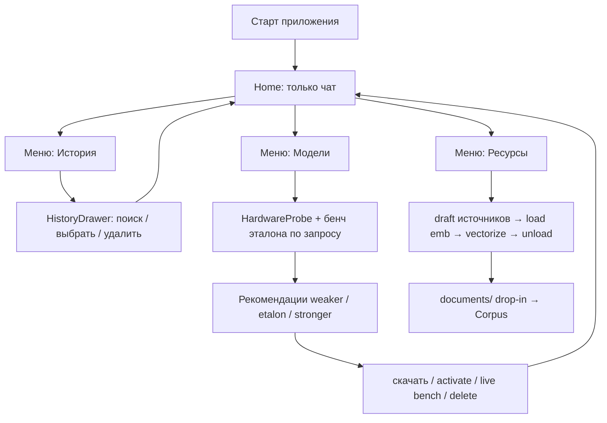
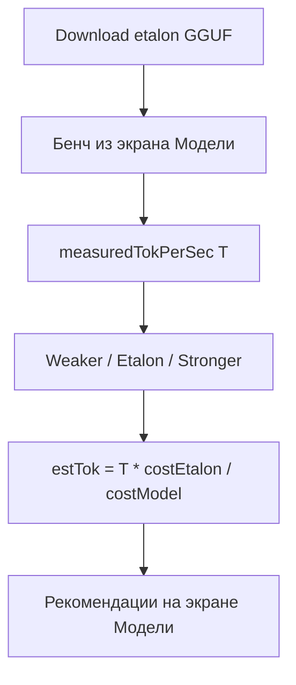
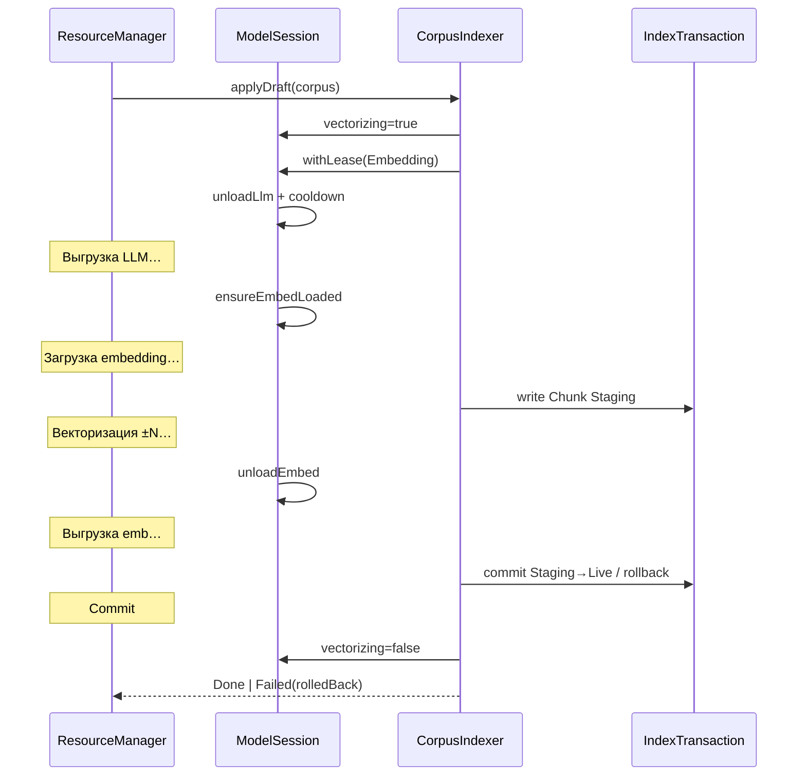
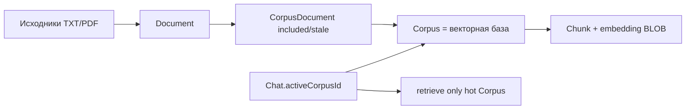

# RAGG — полный поэтапный план

Локальный RAG на Kotlin Multiplatform: профилирование устройства, менеджер моделей с оценкой производительности, **инференс целиком на llama.cpp (GGUF)** для LLM и embedding, документы и **выбираемые векторные базы** по источникам, чат.

**Таргеты сейчас:** Android, Desktop (JVM), iOS (stubs).  
**Позже:** Web/Wasm (FileReader).

**UI-эталон:** интерактивное демо [`docs/demo/`](demo/) (HTML/CSS/JS) — визуал, навигация и паттерны экранов для Compose.

---

## Зафиксированные решения

| Тема | Решение |
|------|---------|
| Каталог моделей | Зашит в приложение (URL HF/зеркало, размер, quant, paramB, minRam, **format**: `gguf`, role: Llm / Embedding) |
| Инференс | **Всё на llama.cpp**: LLM и embedding — GGUF за `LlmEngine` / `EmbeddingEngine` (два контекста; Mock для UI без натива) |
| Почему один стек | Максимум выгоды на phone: mmap + Q4_K, без налога второго рантайма (ORT) на RAM под векторы/KV/большую LLM |
| Оценка скорости | **Якорь = бенч эталонной GGUF LLM на этом устройстве** (эталон **скачивается**, не в assets); остальные — слабее/сильнее относительно неё |
| Главный экран | **Только чат**: сообщения + ввод; **новый чат** и **сохранить TXT** в шапке |
| Меню (drawer слева) | **История** · **Модели** · **Ресурсы** |
| История | Отдельный **drawer слева** (как меню): поиск, список, удаление чата; выбор → закрыть drawer → открыть чат. Отдельной иконки истории в шапке **нет** |
| Ресурсы | Исходники + **векторные базы (Corpus)**; загрузка / обновление / удаление; drop-in в `documents/` |
| Векторные базы | Несколько **Corpus** на диске; у чата — **ровно одна** активная (`Chat.activeCorpusId`); retrieval только по ней |
| Default Corpus | При первом старте создаётся **Default**; новый чат без выбора базы → `activeCorpusId = Default` |
| doc ↔ Corpus (v1) | **UI: один документ → одна Corpus** (схема SQL может допускать N:N позже; в v1 не предлагать «один файл в двух базах» — иначе дубль BLOB) |
| Смена активной базы | Меняет retrieval **только для новых ответов**; история сообщений не переписывается; в шапке чата — badge/имя активной Corpus |
| Обновление индекса | Черновик → «Обновить»: **unload LLM → (opt) load emb → delta → unload emb**; только removals — без load emb |
| Сериализация AI | Единый `ModelSession` + **serial Mutex/dispatcher** на JNI: нельзя embed ∥ generate ∥ bench; чат при `vectorizing` — **обязательный** блок (`Blocked(Indexing)`) |
| Транзакция индекса | Staging → **атомарный commit**; при снятии с индекса / удалении ресурса — **физическое DELETE чанков** (не хранить «мёртвые» векторы) |
| Обрыв / отмена индекса | **Нет resume mid-embed.** Cleanup Staging → `status=Ready` → UI «нажмите Обновить снова». `IndexJob.snapshotDraftJson` — аудит / повтор applyDraft, не продолжение с середины |
| Отмена до Running | На фазах UnloadLlm / LoadEmbed (Staging ещё пуст) — сразу `Cancelled`, Live цел; Commit — атомарная SQL-tx, mid-cancel не применяется |
| Снятие с индекса vs удаление | Снять (uncheck): файл остаётся, **все Chunk этой пары corpus×doc удаляются**, `included=false`. Корзина: файл + метаданные + чанки. Повторное включение = **полный re-embed**, не «достать старые BLOB» |
| Изменение файла на диске | Scan при открытии Ресурсов (+ «Обновить»): `contentHash` ≠ → `stale`; re-embed **только** по явному applyDraft, не в фоне |
| Lifecycle моделей | Emb эфемерна; **¬(emb ∧ llm) резидентно (I1)**; query-path **последовательно**: emb → unload → retrieve → LLM (+ hot-set); после unload — yield + `availableRam` |
| Бюджет latency query | Целевой overhead swap на mid-phone: **embed query ≤ ~2 с** до retrieve; UI: состояние «Готовим контекст…» (не пустой Idle). Idle-keep emb **не** экономит turn (после LLM emb всё равно выгружен) — не рассчитывать на него в чате |
| Бенч эталона | Этапы 0–5: Mock / синтетический tok/s для UI и API. **Реальный** GGUF-бенч через llama.cpp — критерий **этапа 6**; unload/cooldown — **повторно замерить на устройстве** в 6 |
| Infer backend v1 | **CPU-first** (phone и mid Mali). `preferredBackend` / GPU-скоринг — advisory для fit/UI; реальный GPU/Vulkan offload — опция этапа 7 (desktop) |
| Хранилище | Размеры исходников + БД эмбеддингов **по каждой Corpus** в Менеджере ресурсов; (после v1, если N:N) doc×N → дубли BLOB, StorageStats суммирует |
| Модели | Экран **Модели**: установленные / каталог; действия **иконками**; здесь же калибровка и рекомендации (не при старте) |
| Старт приложения | **Всегда Home (чат)** по умолчанию; принудительного онбординга моделей **нет** |
| Чат без моделей / без базы | Home **не** ворота: composer виден + подсказка. **Send**: без моделей → `Blocked(NoModels)` / ошибка с CTA в Модели; без Corpus → `Blocked(NoActiveCorpus)` |
| Настройка моделей | Пользователь сам заходит в меню → **Модели** (бенч эталона, рекомендации, скачивание, активация) |
| Эталон (GGUF) | Одна LLM в каталоге, `isEtalon=true` (напр. SmolLM-360M Q4 / Qwen2.5-0.5B Q4). **Всегда download** в `CachePaths/models` по кнопке **Начать** (пустые Установленные) или из набора. **Не** класть GGUF в APK/assets |
| GGUF в assets | **Запрещено в v1:** ни etalon, ни embedding, ни прочие веса. В APK — только метаданные каталога (id, URL, sha256, size, …) |
| Целостность загрузок | У etalon и embedding в каталоге **`sha256` обязателен**; у прочих моделей каталога — тоже обязателен для релиза v1 |
| Embedding-модель | Отдельный **GGUF embed** (маленький multilingual / nomic / bge-small и т.п.); тоже **только download**; не instruct «вместо» embed |
| Векторный поиск | BLOB в SQLDelight + cosine в Kotlin; working set = чанки **активной Corpus**; на phone — бюджет (`maxHotChunks` / `maxHotVectorBytes`), иначе page/top-k из SQL. До FTS (этап 7): жёстче лимит знаний **или** простой keyword prefilter (`LIKE`/лёгкий FTS) в 5c/6 |
| Лимит исходников | По **извлечённому тексту и числу чанков на Corpus**, не по формату файла; TXT≈текст, PDF дороже на парсинге |
| Ориентация | Только **портрет**; landscape на телефоне — экран-заглушка «поверните устройство» |
| Фон / сворачивание | **Process death** → восстановление только из БД/флагов (чат, draft, Calibration). Краткий background (Activity recreate) → сохранить UI state; **не** обещать фиксированные «~5 с» как SLA. llama-контексты — unload по low-memory |
| Визуал | Оттенки **серого и перламутра**; бренд **RAGG** как сильный сигнал; адаптив phone / desktop |
| DI / сеть / БД / UI | Koin, Ktor, SQLDelight, Compose + Voyager |
| ONNX / прочие backend | Вне скоупа v1; не подключать второй инференс-рантайм |
| Документ плана | Канон решений — эта таблица + инварианты I1–I10 + схема этапа 5; этапы описывают **дельты и критерии**, без противоречащих копий |

---

## UI / дизайн (по демо)

Референс: [`docs/demo/`](demo/) — палитра, компоновка, иконки, поведение drawer.

### Визуальный язык

- Фон: перламутровые градиенты / sheen (серо-серебристый, без «фиолетового AI» и без кремово-терракотового клише).
- Поверхности: полупрозрачные карточки, тонкие границы, мягкая тень.
- Типографика: выразительный display для бренда (в демо — Syne), UI-sans для текста (Figtree); в Compose — аналогичный pair, не Inter/Roboto по умолчанию.
- Акценты: нейтральный graphite; статусы — muted green / amber / rose для badge.
- Иконки действий вместо текстовых кнопок там, где действие вторичное (модели, документы, история).

### Адаптив и устройство

| Правило | Детали |
|---------|--------|
| Phone | Портрет; drawer меню и истории на всю высоту слева |
| Desktop | Тот же flow; контент в «окне» приложения; drawer шире (~320px) |
| Поворот | Запрещён (lock portrait + UI-gate) |
| Сворачивание ≤5 с | Сохранить экран/чат; при возврате продолжить без сброса на Home |

### Карта экранов (как в демо)

```text
[старт приложения]
  → Home (чат)   ← всегда по умолчанию

Home (чат)
  шапка: меню | RAGG + название чата | сохранить TXT · новый чат
  тело: сообщения
  низ: composer
  меню → История  → HistoryDrawer (слева) → выбор чата → Home
  меню → Модели   → ModelManagerScreen → закрыть → Home
  меню → Ресурсы  → ResourceManagerScreen → закрыть → Home
```

Настройка железа / бенч / рекомендации / скачивание — **только** внутри экрана **Модели** (по инициативе пользователя), не как ворота перед чатом.

### Home

- Только чат; **нет** списка документов / моделей / storage.
- **Новый чат** (иконка +).
- **Сохранить чат как `.txt`** (иконка рядом с +).
- История **не** в шапке — только через меню.
- Если модели ещё не настроены: чат доступен (mock / подсказка «настройте модели в меню»); вход не блокировать.

### HistoryDrawer

- Тот же паттерн, что меню: выезд **слева**, backdrop, закрытие по backdrop / после выбора.
- Поиск по названию и тексту сообщений.
- Строка чата: открыть · корзина удалить.
- Выбор чата: свернуть drawer и показать выбранный диалог.

### ModelManagerScreen

- Якорь (только после бенча): «это устройство · эталон · N ток/с». До калибровки pill якоря **не показываем**.
- Пустой блок **Установленные**: «Нет скачанных моделей.» + короткий текст о первичной настройке / скачивании эталона + кнопка **Начать** справа (download etalon → бенч).
- При отсутствии якоря: настройка только здесь (не на старте приложения).
- Карточка: **название + badge** в одной строке; meta ниже.
- Действия **справа иконками**: активировать, прогнать вживую, удалить; в каталоге — скачать.
- Группы: Установленные / Каталог (и секции рекомендаций после бенча).

### ResourceManagerScreen

- Сверху StorageStats (исходники, БД **по базам**, модели, всего).
- Блок **Векторные базы (Corpus)**: список, создать / переименовать / удалить; **активировать** базу для поиска в текущем чате.
- Подсказка: отметить источники → «Обновить» — **embedding загружается только на время векторизации, затем выгружается**; drop-in в `documents/`.
- Заголовок «Документы» + фильтр по базе + иконки **обновить индекс** и **добавить**.
- Строка документа: чекбокс черновика (`draft` ≠ уже в индексе); статусы «В индексе» / «Будет добавлен» / «Будет убран» / «Не в индексе»; meta + корзина.
- Блок прогресса векторизации (**как в демо, до 5 фаз**): **Выгрузка LLM… → Загрузка embedding… → Векторизация ±N… → Выгрузка emb… → Commit**; removals-only — одна фаза без emb. На время `vectorizing` — **блок** UI Ресурсов и composer на Home (`Blocked(Indexing)`). Кнопка **Отмена** → rollback Staging, Live цел.
- Кнопка **обновить** применяет diff черновика к индексу (инкремент); полный rebuild — при смене embedding-модели.

### Лимиты ресурсов (смартфон)

- Целевой объём **на активную Corpus**: порядка **10–20 документов** или жёстче — по `maxChunks` / `maxVectorBytes` / `maxExtractedChars`.
- Упор: **RAM**. Пик при индексации = embed GGUF (+ буферы), **без** LLM. В чате пик **последовательный** (не одновременный): краткий emb на query → unload emb → hot-set retrieve → LLM; **¬(emb ∧ llm)** (I1).
- Embedding после индексации **обязательно unload** — иначе нет выигрыша под LLM/векторы.
- Много баз на диске ок; в RAM / cosine — **только активная** (hot-set).
- Hot-set: если Live corpus > `maxHotChunks` / `maxHotVectorBytes` — не грузить всю базу в heap; cosine по страницам / candidate set (FTS prefilter в этапе 7, до него — SQL LIMIT + batch).
- Лимит знаний = извлечённый текст и чанки; формат (TXT/PDF) влияет на парсинг, не на формулу поиска после индекса.

---

## Целевая архитектура



### Пакеты `sharedLogic`

- `device/` — HardwareProbe, CapabilityScore, lookup-таблицы SoC/GPU
- `models/` — Catalog, PerfEstimator, ModelManager, Downloader
- `cache/` — CachePaths expect/actual
- `db/` — SQLDelight (Corpus, Document, Chunk, Chat, Calibration, …)
- `docs/` — DocumentParser, CorpusIndexer, IndexTransaction
- `ai/` — ModelSession (serial), LlmEngine, EmbeddingEngine (llama.cpp/GGUF), Mock
- `di/` — Koin-модули
- `chat/` — история чатов, экспорт TXT, `activeCorpusId`; уважает `ModelSession.vectorizing` / `lease`

---

## Старт приложения и настройка моделей

### Поток UX

1. **Запуск** → сразу **Home (чат)**. Без экрана проверки мощности и без мастера скачивания.
2. Меню → **История** (drawer слева: поиск, выбрать, удалить).
3. Меню → **Ресурсы**: StorageStats; draft состава индекса; «Обновить» = load emb → vectorize → unload; drop-in в `documents/`.
4. Меню → **Модели** (когда пользователь сам решил настроить):
   - снять `HardwareProfile` при необходимости;
   - пустые Установленные → **Начать**: скачать эталон → бенч (нужна сеть);
   - прогресс: «Прогрев…» → «Генерация…» → `N ток/с`;
   - сохранить якорь `Calibration(etalonModelId, backend, tokPerSec, deviceFingerprint)`;
   - показать рекомендации weaker / etalon / stronger;
   - скачать / активировать выбранные (для RAG: embedding + LLM);
   - «Прогнать вживую» обновляет оценку / якорь.
5. Закрыть Модели (✕) → Home.

Отдельного онбординга `PowerCheck → Recommendations → Download → Home` **нет**.

### Эталонная модель (download-only)

| Свойство | Решение |
|----------|---------|
| Что | Одна **GGUF** LLM из каталога, `isEtalon = true` |
| Кандидат | **SmolLM-360M Q4** или Qwen2.5-0.5B Q4_K_M (и аналоги) — выбор по размеру/качеству якоря, не по «влезет ли в APK» |
| Доставка | **Только download** (HF/зеркало) → `CachePaths/models`. Поле `bundledInApp` **не используем**; GGUF **не** в assets |
| Первый бенч | **Начать** (блок Установленные): download etalon → бенч → `Calibration`. Offline без файла → ошибка «нужна сеть» |
| Embedding | Отдельный GGUF embed, тоже **только download**, тот же llama.cpp |
| Backend | Один натив llama.cpp; два контекста: `genCtx` (LLM) и `embedCtx` (embedding); n_threads от cores; mmap; **v1: CPU-first**, без GPU offload на mid Mali |
| Бюджет APK | Веса моделей **не** раздувают установку; в APK только код + JSON-каталог |

Ранжирование остальных — **после** бенча в Моделях (после успешного download etalon).

### Ранжирование «слабее / сильнее»

После бенча эталона с `measuredTokPerSec = T`:

```text
# Относительная «стоимость» генерации (безразмерная). Больше = медленнее.
# quantFactor: Q8≈1.0, Q5≈0.85, Q4_K≈0.75, Q3≈0.65 (подстроить по замерам)
cost(model) =
  model.paramBillions
  * quantFactor(model.quantName)
  * (model.approxLayers / etalon.approxLayers).coerceAtLeast(0.5)
  // embedding-role: cost не для tok/s; отдельная оценка embedMs от dim + size

relativeClass(model) =
  Weaker   если cost(model) < cost(etalon) * 0.95
  Etalon   если model.id == etalon.id
  Stronger если cost(model) > cost(etalon) * 1.05
  // иначе Etalon-tier (почти равны)

estTok(model) = T * cost(etalon) / cost(model)

comfort =
  Comfortable если estTok >= minComfortTokPerSec  // напр. 3.0
  Slow        если 1.0 .. minComfort
  Impractical если < 1.0 или fit == Insufficient
```

UI-группы **на экране Модели** (после калибровки):

- **Рекомендуем** — Etalon и/или Weaker с Comfortable + Fits (и нужный embedding).
- **Можно сильнее** — Stronger с Fits и не Impractical; бейдж «медленнее эталона на ~X%».
- **Не стоит** — Insufficient / Impractical (свёрнуто или disabled).

«Скачать рекомендованный набор» = **download** embedding + лучший Comfortable LLM (часто сам эталон, если ещё не скачан) → activate.

### Состояния калибровки (экран Модели)

```kotlin
sealed interface CalibrationUiState {
  data object NotCalibrated : CalibrationUiState
  data object PreparingHardware : CalibrationUiState
  data class DownloadingEtalon(val progress: Float?) : CalibrationUiState
  data class Benchmarking(val phase: String, val progress: Float?) : CalibrationUiState
  data class Ready(
    val profile: HardwareProfile,
    val etalonTokPerSec: Float,
    val groups: RecommendationGroups,
  ) : CalibrationUiState
  data class Error(val message: String) : CalibrationUiState  // в т.ч. offline без файла
}
```

Якорь: `Calibration` с текущим `deviceFingerprint`. Флаг «онбординг завершён» **не нужен** — старт всегда Home.

---
## Этап 0 — Каркас зависимостей и DI

**Цель:** проект собирается с нужными библиотеками, Koin стартует на Android и Desktop; заготовки под натив llama.cpp без обязательной линковки в этом этапе.

### Работы

1. Версии в [`gradle/libs.versions.toml`](../gradle/libs.versions.toml):
   - Koin (core + compose)
   - Ktor Client (OkHttp Android, CIO Desktop) + ContentNegotiation
   - kotlinx.serialization
   - SQLDelight (+ драйверы Android / JDBC)
   - Voyager (navigator, screen model / tabs)
   - kotlinx-coroutines-core в common
2. Подключить зависимости в `sharedLogic` / `sharedUI`.
3. `initKoin { modules(platformModule, networkModule, …) }` из `MainActivity` и Desktop `main`.
4. Заготовки модулей: `platformModule`, `networkModule`, `databaseModule`, `aiModule` (Mock engines), `modelsModule`.
5. Заложить структуру `ai/llama` (expect/actual / JNI stubs, CMake) — реальная линковка в этапах 3/6.

### Критерий готовности

- Приложение запускается; Koin резолвит хотя бы `HttpClient` и заглушку `HardwareProbe`.

---

## Этап 1 — Профилирование железа

**Цель:** на телефоне и ПК получать CPU, RAM, GPU в едином `HardwareProfile`.

### Контракт (common)

```kotlin
data class HardwareProfile(
  val platform: PlatformKind, // Android, Desktop, Ios
  val ram: RamInfo,           // totalMb, availableMb
  val cpu: CpuInfo,           // cores, performanceCores?, maxFreqMhz?, name?, abi?
  val gpu: GpuInfo,           // name, api, vramMbHint?
  val socOrChipset: String?,
)

data class CapabilityScore(
  val cpuScore: Float,  // относительный балл только для tier/fit/ранжирования до калибровки
  val gpuScore: Float,  // 0 = GPU для LLM бесполезен
  val ramScore: Float,
  val tier: DeviceTier, // Low, Mid, High, DesktopHigh
)
```

> **Важно:** `CapabilityScore` не является эталоном tok/s. Эталон производительности — **калибровка на этом же устройстве** (см. этап 2–3).

### Android (`actual`)

| Параметр | Источник |
|----------|----------|
| RAM | `ActivityManager.MemoryInfo` |
| CPU cores | `Runtime.availableProcessors()` |
| CPU freq | `/sys/.../cpufreq/cpuinfo_max_freq` (best-effort) |
| SoC | `Build.SOC_MODEL` / `BOARD` / `HARDWARE` |
| GPU | GLES `GL_RENDERER` (EGL) |
| API | Vulkan / NNAPI feature flags |
| ABI | `Build.SUPPORTED_ABIS` |

### Desktop (`actual`)

| Параметр | Источник |
|----------|----------|
| RAM | `OperatingSystemMXBean` |
| CPU | cores, `os.arch`, Linux `/proc/cpuinfo` |
| GPU | Vulkan-устройства (LWJGL/JNI); fallback GL / `lspci` / CIM |
| VRAM | Vulkan heaps при наличии |

### iOS (`actual` stub)

- `NSProcessInfo` physicalMemory + processorCount, Metal hint.

### Lookup-таблицы

- `KnownSocTable` — например Helio G95 → cpu≈35, gpu≈15 (LLM → CPU).
- `KnownGpuTable` — Mali-G7x, Adreno 6xx/7xx, NVIDIA/AMD desktop.
- Неизвестный чип → эвристика по cores/freq/имени GPU.

### Скоринг (только tier / fit / advisory backend до калибровки)

Нормализация по внутренним константам железа (cores/freq/RAM) — **не** заявка на абсолютный tok/s.

```text
cpuScore = 0.45*norm(cores) + 0.35*norm(freq) + 0.20*socBoost
gpuScore = 0 если непригоден для LLM, иначе lookup/heuristic
preferredBackend = CPU на phone/mid Mali (v1 всегда CPU в рантайме)
                 // GPU hint только для DesktopHigh + этап 7 offload;
                 // не влияет на InferBackend фактического llama.cpp в v1
```

### Критерий готовности

- Unit-тесты: профиль mid-phone 6GB → Mid; desktop 16GB+8c → DesktopHigh/High.
- На Android/Desktop в лог/debug виден заполненный `HardwareProfile`.

---

## Этап 2 — Каталог моделей и оценка производительности

**Цель:** для каждой модели — fit по RAM и ориентир `~tok/с` / ms для embedding.

### ModelCatalog (метаданные в приложении)

Поля артефакта: `id`, `displayName`, `role` (Embedding/Llm), `format` (`gguf`), `sizeBytes`, `minRamMb`, `paramBillions`, `quantBits` / `quantName` (напр. Q4_K_M), `contextLength`, `approxLayers`, `embeddingDim?`, `downloadUrl`, **`sha256`**, `languages`, **`isEtalon`**. Поля `bundledInApp` **нет** — веса только с сети.

Стартовый набор (всё GGUF, всё download):

- **Etalon:** одна LLM Q4 — `isEtalon=true`, download-on-first-bench / из набора
- **Embedding:** маленький multilingual / nomic / bge-small GGUF, `role=Embedding`, download
- Сильнее: Qwen2.5-1.5B Q4_K_M и др., `role=Llm`
- Слабее эталона: если эталон 0.5B — опционально 360M; если эталон уже самый маленький — группа «слабее» пустая

**RAM fit (телефон):** mmap GGUF (рабочий RSS < sizeBytes) + headroom под hot-set активной Corpus + краткий `embedCtx`; не суммировать «полный размер файла = RAM». LLM и embed **не** держать оба тяжёлыми контекстами без нужды.

**cost(model)** — см. формулу в разделе «Ранжирование»; unit-тесты на scale от известных paramB/quant.

### PerfEstimator — якорь = бенч эталона на устройстве



**RAM fit** — от текущего `availableRamMb` (как раньше).

**tok/s** — от якоря эталона после бенча в Моделях (High для эталона, Medium для scale). Пока бенч не прогнан — в каталоге fit по RAM + пометка «без якоря»; не гнать пользователя на отдельный стартовый экран.

`preferredBackend` в `ModelFitCard` — **advisory** (v1 runtime = CPU); не обещать GPU-ускорение до этапа 7.

Повторный бенч / «Прогнать вживую» в Моделях обновляет якорь.

### ModelFitCard

```kotlin
data class ModelFitCard(
  val model: ModelArtifact,
  val fit: FitLevel,
  val preferredBackend: InferBackend,
  val estimatedTokPerSec: ClosedFloatingPointRange<Float>?,
  val estimatedEmbedMs: ClosedFloatingPointRange<Float>?,
  val reason: String,
  val confidence: Confidence,
  val localStatus: LocalModelStatus,
)
```

### Тесты

- Fit по RAM: mid 6GB → 0.5B Fits; 3B Tight/Insufficient.
- После бенча эталона T=5.0 → Weaker/Stronger классы и scale `estTok` от T через `cost()`.
- Unit: `cost(1.5B Q4) > cost(0.5B Q4)`; `estTok` слабее > T, сильнее < T.
- Offline без скачанного etalon → `runEtalonBenchmark()` ошибка «нужна сеть»; после download (до этапа 6 — Mock tok/s) → якорь в БД.
- Чужой `deviceFingerprint` игнорируется.

### Критерий готовности

- `PerfEstimator.estimate(profile, catalog)` возвращает карточки без UI.

---

## Этап 3 — Кэш, загрузка и Model Manager (логика)

**Цель:** скачивание, учёт установленных моделей, активация, калибровка.

### CachePaths (expect/actual)

- Android: `filesDir/models`, `filesDir/documents`
- JVM: `~/.cache/ragg/...`
- iOS: Application Support

### ModelDownloader (Ktor)

- Проверка локального файла (размер / sha256).
- Download во `.tmp` → rename.
- `Flow<DownloadProgress>`.
- URL из каталога (HF или свой baseUrl).

### SQLDelight (модели)

- `InstalledModel(id, path, bytes, sha256, role, active, …)`
- `Calibration(modelId, backend, tokPerSec, deviceFingerprint, measuredAt)`

### ModelManager (facade)

```kotlin
fun observeCards(): Flow<List<ModelFitCard>>
suspend fun runEtalonBenchmark(): Float          // API калибровки; до этапа 6 — Mock tok/s
fun recommendations(): RecommendationGroups      // weaker / etalon / stronger
suspend fun download(modelId: String)
suspend fun cancel(modelId: String)
suspend fun delete(modelId: String)
suspend fun setActive(modelId: String)
suspend fun runBenchmark(modelId: String): Float // живой прогон; до этапа 6 — Mock
```

`runEtalonBenchmark`: если etalon ещё не в cache → сначала `download(etalonId)` (нужна сеть), затем бенч. Скачивание — только GGUF; различает `role=Llm` и `role=Embedding`. **Никаких** копий из assets.

> **Граница Mock / native:** на этапе 3 `runEtalonBenchmark` / `runBenchmark` идут через `MockLlmEngine` (или stub) и пишут синтетический `Calibration.tokPerSec` — чтобы UI Моделей и `PerfEstimator` работали без JNI. Подмена на `LlamaCppLlmEngine` и **реальный** якорь tok/s — **этап 6**.

`StorageStatsProvider.stats(): StorageStats` — показ в **Ресурсах** (позже per-Corpus).

### Калибровка (якорь = бенч эталона на устройстве)

1. Пользователь открывает **Модели** (не обязательный шаг при старте).
2. **Начать** / повторный прогон: **download etalon** (если нет) → бенч → запись `Calibration(...)` (до этапа 6 — mock-значение).
3. Каталог ранжируется: weaker / etalon / stronger + comfort от `estTok` / `cost()`.
4. «Прогнать вживую» обновляет якорь (повторный download не нужен, если файл на месте).
5. UI: после бенча — «Ориентир: … · N ток/с»; до калибровки якорь скрыт; пустые Установленные — «Нет скачанных моделей.» + **Начать**.

### Критерий готовности

- Offline **без** скачанного etalon: бенч недоступен (понятная ошибка).
- С сетью: download etalon (+ embedding / другие) → Mock-бенч → якорь в БД → weaker/stronger.
- Старт приложения при этом всегда открывает Home, не Модели.
- Реальный GGUF-бенч **не** требуется на этом этапе (см. этап 6).
- В APK/assets **нет** файлов `.gguf`.
---

## Этап 4 — UI: Home (чат), меню, Модели / Ресурсы

**Цель:** старт с чата; история / модели / ресурсы — из меню. Визуал и IA — по [`docs/demo/`](demo/). Принудительного онбординга моделей нет. Логика индекса / `ModelSession` — **mock**; реальный serial/tx — этап 5.

### HomeScreen (главный — открывается при старте)

- Шапка: **меню** · бренд RAGG + название чата · **сохранить TXT** · **новый чат**.
- Сообщения + composer + стриминг (`ChatState`).
- На Home **нет** списка документов, моделей, storage, **нет** иконки истории.
- Без настроенных моделей — не блокировать; подсказка зайти в меню → Модели.
- Подписка на mock/`vectorizing`: при индексации composer → `Blocked(Indexing)` (**обязательно**, не «желательно»).

### Меню (drawer слева)

| Пункт | Поведение |
|-------|-----------|
| История | `HistoryDrawer` слева (поиск / список / удалить) → выбор → pop drawer → чат |
| Модели | `ModelManagerScreen` → закрыть (✕) → Home |
| Ресурсы | `ResourceManagerScreen` → закрыть (✕) → Home |
| (позже) Настройки / о приложении | — |

### HistoryDrawer

1. Поиск по названию и тексту сообщений.
2. Список чатов: открыть / удалить (корзина).
3. Выбор чата закрывает drawer и показывает диалог на Home.

### ModelManagerScreen (вся настройка моделей)

1. Якорь устройства — только после бенча (иначе скрыт).
2. Пустые Установленные → текст + **Начать** (download etalon → бенч); после — рекомендации weaker / etalon / stronger; скачивание набора (etalon + embed — оба с сети).
3. Установленные: иконки activate / «прогнать вживую» / delete (etalon тоже можно удалить → снова пустой блок с **Начать**); badge у названия.
4. Каталог: иконка скачать (включая эталон, пока не установлен).
5. Отдельного `DevicePowerCheckScreen` как первого экрана приложения **нет** — логика калибровки встроена сюда.

### ResourceManagerScreen

1. **StorageStats:** исходники / БД (сумма и **per-Corpus**) / модели / всего (mock или лёгкий подсчёт файлов).
2. **Векторные базы:** список Corpus; создать / переименовать / удалить; **сделать активной** (одна на чат).
3. Подсказка: чекбоксы = черновик состава индекса; embedding **load → vectorize → unload** только по «Обновить»; drop-in → выбранная/Default Corpus.
4. «Документы» + иконки **обновить индекс** и **добавить**; UI прогресса (**до 5 фаз**, как в [`docs/demo/`](demo/)): UnloadLlm → LoadEmbed → Running → UnloadEmbed → Commit; removals-only — одна фаза.
5. Diff: `draftIncluded` vs `indexed` → toAdd / toRemove; статусы pending на карточках.
6. На время векторизации: `vectorizing=true` — нельзя менять состав, удалять, добавлять; **обязательно** `ChatState.Blocked(Indexing)` на Home; кнопка **Отмена** (на этапе 4 — отмена mock-таймера).
7. После успеха: commit черновика в индекс (mock), emb «выгружена», StorageStats обновлён.

> UI-контракт демо (draft + фазы + блок чата) — этап 4 на **mock**. `ModelSession` / `IndexTransaction` / физический DELETE — **этап 5**.

### Навигация

```text
[старт]       Home (чат)
                ├─ меню → HistoryDrawer → select chat → Home
                ├─ меню → ModelManager → закрыть → Home
                └─ меню → ResourceManager (draft docs → mock vectorize) → закрыть → Home
```

### Критерий готовности

- Приложение стартует на Home; онбординг-моделей нет.
- История только из меню-drawer; Модели/Ресурсы — закрыть ✕.
- В Ресурсах: черновик состава, mock-прогресс до 5 фаз (и removals-only), блок UI + composer при `vectorizing`.
- Калибровка и скачивание доступны из Моделей (wire к этапу 3).
- Портрет; UI соответствует демо по структуре экранов.
- Нет требования, что индекс уже транзакционный — это этап 5.

---

## Этап 5 — Менеджер ресурсов, Corpus, drop-in, учёт размера

**Цель:** исходники и **несколько векторных баз**; draft состава; applyDraft с load/unload embedding; StorageStats; serial `ModelSession`.

Внутри этапа — три поставки (можно отдельные PR):

| Подэтап | Фокус | Готово когда |
|---------|--------|--------------|
| **5a** | Схема SQLDelight + draft/diff UI-wire + drop-in + StorageStats (без натива) | CRUD Corpus/Document; `draftIncluded`; mock apply пишет «индекс» без emb |
| **5b** | `ModelSession` (Mutex, lease, unload/cooldown, `vectorizing`) + Mock engines | Unit: lease serial; `runGenerate` отвергается при `vectorizing` |
| **5c** | `IndexTransaction` + `CorpusIndexer.applyDraft` + cancel + startup cleanup + тесты I1–I8 | Реальный Staging→commit; removals DELETE; orphan GC |

### CachePaths / DocumentsDir

- `…/documents` — drop-in + файлы из «Загрузить» (физически общие; логическая привязка к Corpus в БД).
- `DocumentWatcher` / scan при открытии Resource Manager и по «Обновить».

### Модель данных (SQLDelight)

```text
Corpus(
  id, title, embeddingModelId, createdAt, updatedAt,
  status,              -- Ready | Indexing
  indexJobId?,         -- текущая/оборванная операция
  chunkCount, vectorBytes, liveRevision
)
Document(id, title, sourcePath, sourceBytes, createdAt, contentHash, status)
CorpusDocument(corpusId, documentId, included, draftIncluded, indexedRevision, stale)
Chunk(
  id, corpusId, documentId, ordinal, text,
  embedding BLOB, embedRevision,
  stage               -- Live | Staging
)
IndexJob(
  id, corpusId, kind,  -- ApplyDraft | Rebuild
  startedAt, phase,   -- UnloadLlm | LoadEmbed | Running | UnloadEmbed | Commit | Cancelling
  error?,
  snapshotDraftJson?,  -- аудит / повтор applyDraft после обрыва (НЕ mid-embed resume)
  finishedAt?,
  outcome?             -- Done | Failed | Cancelled
)
Chat(..., activeCorpusId)  -- ровно одна активная база на чат
```

- UI чекбоксов → `draftIncluded`; retrieval / cosine / FTS / StorageStats индекса — **только** `included=true` **и** `Chunk.stage=Live`.
- **Запрещено** оставлять embedding-BLOB при `included=false`.
- Один документ → несколько Corpus (v1: UI может ограничить 1→1; схема допускает N; чанки/BLOB **дублируются** per corpus — StorageStats суммирует).
- Смена `embeddingModelId` → `rebuild` (новые Staging, затем замена Live).
- Статус `NeedsRollback` **не используем**: при обрыве всегда cleanup Staging → `Ready` (см. startup).

### Политика удаления (без призраков в поиске)

| Действие | Исходник | Document | CorpusDocument | Chunk + embedding |
|----------|----------|----------|----------------|-------------------|
| Снять с индекса (uncheck + Обновить) | остаётся | остаётся | `included=false` | **DELETE все** по (corpusId, documentId) |
| Снова включить | остаётся | остаётся | `included=true` после commit | **заново** chunk+embed (`toAdd`); старых BLOB нет |
| Корзина «удалить ресурс» | удалить файл | DELETE | DELETE | **DELETE** |
| Удалить Corpus | файлы: см. orphan GC | — | DELETE связей | **DELETE** Chunk корпуса |

```text
I7  included=false ⇒ нет Chunk для этой пары corpus×doc
I8  re-include ⇒ re-embed (нет undelete BLOB)
I9  ровно один activeCorpusId на Chat; retrieval только по нему
I10 нет mid-embed resume: обрыв/cancel ⇒ Staging gone, Live цел, повтор applyDraft
```

Почему не кешировать векторы «на потом»: на phone риск ложных cosine-hit и рассинхрона `contentHash`/модели выше выгоды диска. Быстрый re-include без re-embed — только явная стадия `Parked` вне retrieval (не v1).

### Orphan GC (файлы в `documents/`)

Запуск: после удаления Document / Corpus, при открытии Resource Manager, и best-effort при старте.

```text
orphans = files(documents/) − { Document.sourcePath | Document существует }
для каждого orphan: удалить файл (лог); не трогать модели/
Document без файла на диске → UI stale + предложить удалить метаданные
```

Общий файл, ещё привязанный к другому Corpus через `CorpusDocument`, **не** удалять при удалении одной базы.

### ModelSession — сериализация (обязательно) — подэтап 5b

Один процессный фасад; все вызовы llama.cpp только через него.

```kotlin
enum class AiLease { Idle, Embedding, Generation, Benchmark }

interface ModelSession {
  val lease: StateFlow<AiLease>
  val vectorizing: StateFlow<Boolean>          // true на весь applyDraft/rebuild (вкл. removals-only)
  val embedResident: Boolean
  val llmResident: Boolean

  /** Единый serial scope: Mutex + limitedParallelism(1) для JNI */
  suspend fun <T> withLease(lease: AiLease, block: suspend () -> T): T

  suspend fun ensureEmbedLoaded(modelId: String)
  suspend fun unloadEmbed()
  suspend fun ensureLlmLoaded(modelId: String)
  suspend fun unloadLlm()

  /** После unload: yield + optional delay; не грузить следующий GGUF мгновенно */
  suspend fun cooldownAfterUnload()
}

/** Чат / бенч / индекс — только через эти entry-points */
suspend fun ModelSession.runEmbed(block: suspend EmbeddingEngine.() -> T): T =
  withLease(AiLease.Embedding) {
    // ensure embed; unload LLM if needed; block; policy unload/idle
  }

suspend fun ModelSession.runGenerate(block: suspend LlmEngine.() -> T): T =
  withLease(AiLease.Generation) {
    check(!vectorizing.value) { "indexing" }
    // unload embed (unless idle-keep); ensure LLM; block
  }
```

Правила:

1. `withLease` взаимно исключает Embedding / Generation / Benchmark.
2. Любой `ensureEmbedLoaded` внутри себя делает `unloadLlm()` + `cooldownAfterUnload()` при необходимости.
3. `vectorizing=true` на время всей транзакции индекса (включая removals-only) → `runGenerate` → `ChatState.Blocked(Indexing)`.
4. Native calls — **только** на `Dispatchers`-serial (не Default pool); запрет embed∥generate на разных потоках.
5. `onTrimMemory` / фон → `unloadEmbed` + `unloadLlm` через тот же Mutex (не гонка с индексом).

### IndexTransaction — commit / rollback / cancel — подэтап 5c

```text
applyDraft / rebuild:

  1. INSERT IndexJob; Corpus.status = Indexing; vectorizing=true
     сохранить snapshotDraftJson (= текущий draft) для аудита / UI «повторить»
  2. diff: toAdd / toUpdate(contentHash) / toRemove
  3. if toRemove only (нет toAdd/toUpdate):
       в ОДНОЙ SQL-транзакции:
         DELETE Chunk WHERE corpusId AND documentId IN toRemove
         UPDATE CorpusDocument SET included=false, …
         пересчитать chunkCount / vectorBytes
       IndexJob done; status=Ready; vectorizing=false; return  // без emb
  4. ModelSession: unloadLlm → cooldown → ensureEmbedLoaded
  5. для каждого doc в toAdd∪toUpdate:
       писать Chunk.stage=Staging (retrieval их не видит)
       emit VectorizeProgress.Running
       if cancel requested → goto cancel
  6. unloadEmbed (finally)
  7. COMMIT-фаза (одна SQL-транзакция на corpus):
       DELETE Chunk WHERE stage=Live AND documentId IN (toRemove ∪ toUpdate)
       UPDATE Chunk SET stage=Live WHERE stage=Staging
       для toRemove: included=false (чанков уже нет)
       для toAdd/toUpdate: included=true; indexedRevision++; stale=false
       обновить chunkCount, vectorBytes, liveRevision
       Corpus.status = Ready; IndexJob outcome=Done; vectorizing=false
  8. при ошибке / OOM:
       DELETE Chunk WHERE stage=Staging
       Live и included без изменений
       Failed(rolledBack=true); status=Ready; vectorizing=false

cancel (кнопка «Отмена» / JobCancellation):
  phase=Cancelling
  прервать embed loop; unloadEmbed
  DELETE Chunk WHERE stage=Staging
  Live / included неизменны; draft на UI сохраняется
  IndexJob outcome=Cancelled; status=Ready; vectorizing=false
  Failed(rolledBack=true) или отдельный Cancelled в Flow
```

Важно: шаг 7 **сначала удаляет** старые Live убираемых/обновляемых документов, **потом** поднимает Staging — всё в одной tx. После commit для снятых документов **нулевой** Chunk.

**Нет resume mid-embed:** `snapshotDraftJson` не продолжают с ordinal N; после обрыва пользователь жмёт «Обновить» снова (полный diff от актуального draft).

Старт приложения:

```text
если Corpus.status == Indexing или IndexJob открыт (finishedAt IS NULL):
  DELETE Chunk WHERE stage=Staging
  IndexJob.outcome = Failed (interrupted); finishedAt = now
  status=Ready; vectorizing=false
  UI: «Индексация прервана — нажмите Обновить снова»
  // Live не трогали → ложных совпадений от Staging нет
```

Retrieval:

```sql
-- канонический фильтр (и в Kotlin working set тот же предикат)
SELECT c.* FROM Chunk c
JOIN CorpusDocument cd ON cd.corpusId = c.corpusId AND cd.documentId = c.documentId
WHERE c.corpusId = :active
  AND cd.included = 1
  AND c.stage = 'Live'
```

Даже при баге «забыли JOIN» — после remove чанков физически нет. При restore без re-embed искать нечего → UX «нужно Обновить».

### CorpusIndexer

```kotlin
interface CorpusIndexer {
  suspend fun addDocuments(corpusId: String, paths: List<String>)
  suspend fun removeDocument(corpusId: String, documentId: String)
  suspend fun setDraftIncluded(corpusId: String, documentId: String, included: Boolean)
  fun applyDraft(corpusId: String): Flow<VectorizeProgress>
  fun rebuild(corpusId: String): Flow<VectorizeProgress>
  fun cancelActiveJob(corpusId: String)          // cancel mid-apply
  fun observeCorpus(corpusId: String): Flow<CorpusStats>
}

sealed interface VectorizeProgress {
  data object UnloadingLlm : VectorizeProgress
  data class LoadingEmbed(val modelId: String) : VectorizeProgress
  data class Running(val done: Int, val total: Int, val added: Int, val removed: Int) : VectorizeProgress
  data object UnloadingEmbed : VectorizeProgress
  data object Committing : VectorizeProgress
  data object Cancelling : VectorizeProgress
  data object Done : VectorizeProgress
  data class Failed(val message: String, val rolledBack: Boolean) : VectorizeProgress
  data object Cancelled : VectorizeProgress
}
```

Политика phone:

1. Пик RAM = только emb (или только LLM), никогда оба.
2. Removals-only → без load emb; `vectorizing` всё равно true на время короткой tx.
3. `finally` → `unloadEmbed` + сброс `vectorizing`.
4. Бюджеты `maxChunks` / `maxVectorBytes` / `maxExtractedChars` — fail **до** commit (Staging чистится).
5. Векторы: f16/i8; chunk 256–384 tok, overlap 10–15%.
6. Idle-timeout emb на Home (напр. 45–60 с) — опция внутри `runEmbed`, не ломает сериализацию.
7. Hot-set: `maxHotChunks` / `maxHotVectorBytes`; иначе batch cosine из SQL, не полный heap load.

### Тесты (этап 5c — критерий)

- Unit: removals-only не вызывает `ensureEmbedLoaded` и **удаляет все Chunk** документа.
- Unit: после uncheck `SELECT` по documentId → 0 чанков; cosine не видит текст снятого doc.
- Unit: re-include того же файла создаёт новые Chunk id/revision (не undelete).
- Unit: при исключении mid-run Staging нет, Live неизменны (`rolledBack=true`).
- Unit: cancel mid-run → Staging gone, Live цел, `Cancelled`.
- Unit: `runGenerate` во время `vectorizing` отвергается.
- Unit: два параллельных `withLease` не пересекаются (Mutex).
- Unit: `cost()` / estTok scale (если ещё не в этапе 2 — smoke).
- После «crash» (статус Indexing при старте) — Staging очищен, Live цел, outcome Interrupted.
- Orphan GC: файл без Document удалён; файл с двумя Corpus остаётся после удаления одной.

### StorageStats

```kotlin
data class StorageStats(
  val sourcesBytes: Long,
  val databaseBytes: Long,
  val modelsBytes: Long,
  val totalBytes: Long,
  val perCorpus: List<CorpusStorageRow>,
)
```

Считать только `Chunk.stage=Live` (+ исходники: уникальные `sourcePath`, не ×N Corpus). Векторы в `perCorpus` — с дублированием, если один doc в нескольких базах.

### DocumentParser + поиск

- TXT потоково; PDF — этап 7 (в 5 — TXT достаточно).
- Retrieval: `included` + `stage=Live` активной Corpus → cosine top‑k (с hot-set бюджетом).
- Query-path только через `ModelSession.runEmbed` → retrieve → `runGenerate`.

### Критерий готовности (весь этап 5)

- **5a:** draft + Corpus CRUD + drop-in + StorageStats.
- **5b:** ModelSession serial + блок чата при `vectorizing`.
- **5c:** applyDraft с фазами UnloadLlm / LoadEmbed / Running / UnloadEmbed / Commit; cancel; startup cleanup; I1–I10.

---

## Этап 6 — Чат и AI-движки (llama.cpp)

**Цель:** RAG-чат со стримингом; LLM и embedding через llama.cpp/GGUF; поиск по активной Corpus.

### Абстракции

```kotlin
interface EmbeddingEngine {
  suspend fun embed(texts: List<String>): List<FloatArray>
}
interface LlmEngine {
  fun complete(prompt: String): Flow<String>
}
class MockLlmEngine : LlmEngine
class MockEmbeddingEngine : EmbeddingEngine
class LlamaCppLlmEngine(...) : LlmEngine           // GGUF instruct, mmap, streaming
class LlamaCppEmbeddingEngine(...) : EmbeddingEngine // GGUF embed, отдельный embedCtx
```

### Жизненный цикл (phone)



| Фаза | Резидентно | Запрещено |
|------|------------|-----------|
| applyDraft / rebuild | только emb (после unload LLM) | generate, bench, второй apply |
| removals-only | ничего | generate (`vectorizing=true` на короткой DB-tx) |
| query embed | emb кратко / idle | generate параллельно |
| generate | LLM | embed, vectorize |
| low-memory | — | держать любой ctx |
| cancel | — | новый apply до сброса `vectorizing` |

`ChatScreenModel` подписан на `ModelSession.vectorizing` / `lease`: composer disabled + текст «Идёт индексация» / «Модель занята».

UI Ресурсов: кнопка **Отмена** на прогрессе → `CorpusIndexer.cancelActiveJob`.

### ChatState

```kotlin
sealed interface ChatState {
  data object Idle : ChatState
  data object Loading : ChatState
  data class Streaming(val text: String) : ChatState
  data class Blocked(val reason: BlockReason) : ChatState  // Indexing, LeaseBusy
  data class Error(val message: String) : ChatState
}
enum class BlockReason { Indexing, LeaseBusy, NoActiveCorpus, NoModels }
```

### UI

- **HomeScreen** — чат; активная Corpus; уважение `Blocked(Indexing)`.
- **HistoryDrawer** — из меню; поиск; выбор закрывает drawer.
- `ChatScreenModel`: только `ModelSession.runEmbed` / `runGenerate`.
- Меню → История / Model Manager / Resource Manager.

### Натив

- Один runtime llama.cpp; **все** вызовы через `ModelSession` serial dispatcher.
- Bench эталона — `withLease(Benchmark)` (вытесняет idle; не во время vectorizing).
- Каталог: `format=gguf`; роли Llm / Embedding не смешивать.

### Навигация Voyager

```text
Start → Home
Home → HistoryDrawer | ModelManager | ResourceManager → закрыть → Home
```

### Критерий готовности

- Wire: чат + TXT + история из меню; UI блок при Indexing (контракт этапа 4–5).
- **Натив:** `LlamaCppLlmEngine` / `LlamaCppEmbeddingEngine` вместо Mock; RAG через serial `ModelSession`; индекс транзакционный.
- **Реальный** бенч эталона GGUF в Моделях → живой `Calibration.tokPerSec` (замена mock-якоря этапа 3).
- Фазы векторизации как в демо (+ UnloadLlm / Commit); query-path: emb → unload → retrieve → LLM.

---

## Этап 7 — Укрепление и полировка

1. PDF-парсинг на Android и Desktop.
2. Стабильный llama.cpp: streaming, бенч, n_threads / ctx / mmap; раздельные `genCtx` / `embedCtx`.
3. FTS-гибрид (ключевые слова + вектор) **внутри активной Corpus**.
4. Compose UI: паритет с [`docs/demo/`](demo/); UI Corpus (создать / активировать / обновить / stale badge).
5. README: стек llama.cpp/GGUF, тиры, лимиты Corpus, как добавить модель в каталог, SoC-таблица.
6. Расширение `KnownSocTable` / `KnownGpuTable` по мере тестов.
7. (Опционально) GPU/Vulkan offload на desktop; на mid-phone CPU-first.
8. (Опционально) Web: FileReader + Wasm-таргет.

---

## Вне скоупа первой поставки (этапы 0–6)

- Полноценный Wasm/Web
- ONNX Runtime / второй инференс-backend
- GPU offload на mid-phone (desktop — опция этапа 7)
- Mid-embed resume индекса (только cleanup + повтор applyDraft)
- Parked / undelete embedding-BLOB
- Облачный каталог моделей (метаданные остаются в APK; веса — download)
- Полный офлайн-бенч всех чипсетов мира (только таблицы + калибровка)
- Облачный/удалённый векторный индекс

---

## Векторные базы и источники (продуктовая модель)



1. Пользователь создаёт базы («Работа», «Учёба», …) в Менеджере ресурсов.
2. Источники в draft; drop-in → текущая/Default (`draftIncluded=true`).
3. **Активная база** — ровно один `Chat.activeCorpusId`.
4. **Обновить** — `applyDraft`: serial ModelSession + IndexTransaction (Staging → commit/rollback/cancel).
5. Смена embedding-модели / «Пересобрать» — `rebuild` той же схемой.
6. StorageStats — Live + уникальные исходники; векторы per-Corpus (с дублированием при doc×N).
7. Файл emb-модели на диске всегда; в RAM — только под lease Embedding.
8. Обрыв / Отмена — **не** resume: cleanup Staging, Live цел, снова «Обновить».

### Инварианты (зафиксировано)

```text
I1  ¬(embedResident ∧ llmResident)
I2  vectorizing ⇒ ¬runGenerate
I3  retrieval ⇒ included=true ∧ stage=Live
I4  ошибка / cancel applyDraft ⇒ Staging удалён, Live без изменений
I5  старт при status=Indexing ⇒ cleanup Staging, предложить повторить (нет mid-embed resume)
I6  все JNI llama.cpp → один serial dispatcher
I7  included=false ⇒ нет Chunk для этой пары corpus×doc
I8  re-include ⇒ re-embed (нет undelete BLOB)
I9  Chat.activeCorpusId — ровно одна база; retrieval только по ней
I10 snapshotDraftJson — аудит/повтор, не продолжение с ordinal N
```

### Подводные камни → закрытие в дизайне

| Риск | Закрытие |
|------|----------|
| Пик LLM+emb | `ensureEmbedLoaded` после `unloadLlm` + cooldown |
| Чат во время векторизации | `vectorizing` + `ChatState.Blocked(Indexing)` (обязательно) |
| Только удаления | без emb + **DELETE Chunk**; `vectorizing` на tx |
| Призраки в поиске после uncheck | физический DELETE векторов (I7) |
| Restore «пустой» поиск | ожидаемо: снова Обновить → re-embed из файла (I8) |
| «Resume» после краша | **нет**: cleanup + повтор applyDraft (I5, I10) |
| Отмена mid-embed | `Cancelling` → Staging DELETE → Live цел |
| Orphan файлы | GC: files − Document.sourcePath; общий файл не трогать |
| Hot-set OOM | `maxHotChunks` / `maxHotVectorBytes` + batch cosine |
| APK раздут весами | GGUF **не** в assets; etalon и embed только download |
| Offline без etalon | Бенч/калибровка недоступны до скачивания; UI объясняет |
| Cold start «Обновить» | draft-батч; опц. idle keep-alive emb |
| Query-path | emb → unload → retrieve → LLM (**последовательно**, I1); бюджет ≤~2 с на embed query; idle-keep не экономит turn |
| Unload ≠ мгновенный RAM | `cooldownAfterUnload` + availableRam |
| Смена emb-модели | `rebuild` + предупреждение UI |
| Гонки JNI | `withLease` + serial dispatcher |
| GPU-обещания в UI | v1 CPU-first; preferredBackend advisory |
| Latency query-path | UI «Готовим контекст…»; замер на устройстве в этапе 6 |

## Сводка этапов

| Этап | Название | Результат |
|------|----------|------------|
| 0 | Зависимости + Koin | Сборка и DI |
| 1 | HardwareProbe + Score | Профиль CPU/RAM/GPU; backend advisory |
| 2 | Catalog + PerfEstimator | GGUF etalon (download), `cost()`, weaker/stronger |
| 3 | Cache + Downloader + Manager API | Download etalon/embed, **Mock**-якорь, скачивание |
| 4 | Home-чат + меню | Старт → Home; mock draft/фазы/блок чата |
| 5a | Corpus schema + draft + StorageStats | CRUD, drop-in, diff |
| 5b | ModelSession serial | lease / vectorizing / cooldown |
| 5c | IndexTransaction + cancel | Staging/commit, I1–I10, orphan GC |
| 6 | Chat + llama.cpp | Native engines; **реальный** бенч; runEmbed→unload→runGenerate |
| 7 | Полировка | PDF, FTS, UX Corpus, desktop GPU opt, docs |

---

## Пример сценария (Helio G95, 6+2 ГБ)

1. Запуск → сразу **Home (чат)**; модели ещё можно не трогать.
2. Меню → Модели → **скачать** etalon (напр. SmolLM-360M Q4) → бенч → например **5–8 ток/с** (mmap, CPU). Offline без файла — ошибка.
3. Эталон = база `cost`; сильнее (1.5B) — `estTok` ниже; скачать embed-GGUF + нужный LLM-GGUF (всё с сети, APK без весов).
4. ✕ → Home; меню → Ресурсы: отметить источники (draft), **Обновить** → UnloadLlm → LoadEmbed → Running → UnloadEmbed → Commit; размеры per-Corpus.
5. Сделать **одну** Corpus активной для чата; второй набор — в другой базе (на диске, не в RAM).
6. Чат: краткий embed query → unload emb → retrieve hot-set → LLM stream (llama.cpp).
7. Меню → История: поиск, выбор чата; сохранение диалога в TXT.
8. Обрыв mid-vectorize / Отмена → Staging очищен; Live цел; снова «Обновить».
